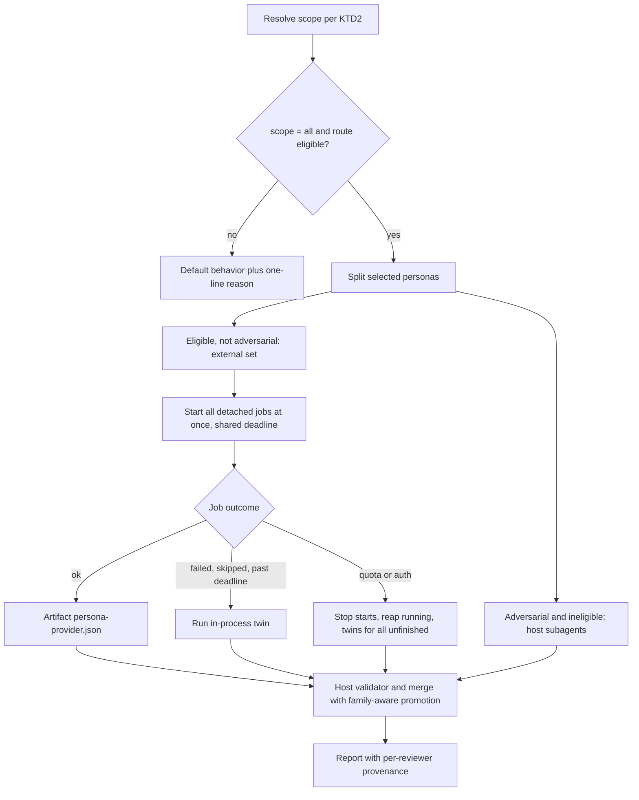
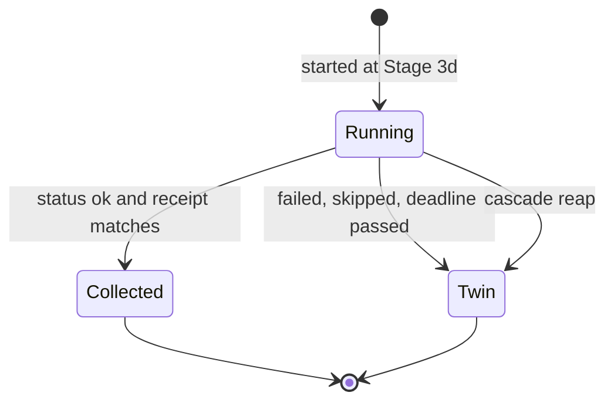

# All Review Personas on a Cross-Model Peer - Plan

---

## Goal Capsule

- **Objective:** A developer running `ce-code-review` or `ce-doc-review` from Claude Code can have every reviewer that can run externally served by another provider's model (e.g. Codex / GPT-5.6), so a large share of review work is spread across providers without switching harness, and the review still reports honestly which model produced each finding.
- **Means:** two opt-in config keys, one per review skill, that widen the existing detached cross-model peer route from one lens to every eligible persona (KTD1, KTD3).
- **Authority:** Product Contract Requirements win on behavior; KTDs win on mechanism; repo `AGENTS.md` rules (prompt budget, byte-duplicated files, no manual version bumps) are hard constraints.
- **Stop conditions:** stop and ask if the 8000-byte `SKILL.md` budget cannot absorb the minimal conditional wording (KTD10), or if a byte-duplicated shared file (`peer-job-runner.py`, the receipt kernel) would have to change.
- **Execution profile:** skill prose, two bash workers, one Python mechanics script, config/docs, bun tests and skill-eval cells. Invoke the repo-local `ce-skill-work` skill before editing `skills/**`.
- **Finish and ship:** the implementer opens a PR on the fork `qchenevier/compound-engineering-plugin`; an upstream PR requires a linked issue first (AGENTS.md contribution gate).

---

## Product Contract

### Summary

Add `cross_model_code_review_scope` and `cross_model_doc_review_scope` (`default | all`). At `default` nothing changes. At `all`, each skill sends every selected persona that can run read-only and emit schema JSON to the resolved cross-model target, keeps the adversarial lens and the ineligible personas on the host, falls back per persona to its in-process twin, and reports each reviewer's provenance.

### Problem Frame

The cross-model pass today sends exactly one lens (code review) or up to three conditional lenses (doc review) to a second provider. Every other persona runs as a host subagent, which on Claude Code can only be a Claude model. A developer who wants to share review load across subscriptions has two options today: accept one external reviewer in four or five, or run the whole review from the Codex CLI, which means maintaining two harnesses. The prior doc-review cross-model plan (`docs/plans/2026-07-09-003-feat-doc-review-cross-model-plan.md`) deferred "full second-model review of every activated persona" as too expensive to be a default; this plan delivers it as an explicit opt-in.

### Requirements

**Settings**

- R1. Two independent config keys, `cross_model_code_review_scope` (read by `ce-code-review`) and `cross_model_doc_review_scope` (read by `ce-doc-review`), each accepting `default` or `all`, resolved with the existing ordinary-key rule (`config.local.yaml`, then `config.yaml`); unset or invalid means `default`.
- R2. A prompt request for one run ("send all reviewers to codex", "only the usual cross-model pass this time") overrides the matching key for that run.
- R3. `cross_model_review_mode: off` still disables all external review, including `all`, unless the user explicitly asks for external review in the conversation; an explicit conversation prohibition always wins.
- R4. `all` reuses the shared `cross_model_peer`, `cross_model_model`, and `cross_model_effort` resolution; no per-scope model keys are added.

**Routing**

- R5. At `all`, every selected persona that is eligible (KTD4) runs through the cross-model worker; ineligible personas and the adversarial lens run in-process on the host.
- R6. `all` applies only where today's pass can run: remote scopes (`pr-remote`, `branch-remote`) start no peer, and code review's lite and focused depth paths keep `default` behavior.
- R7. When the resolved target is the host's own family, or no eligible route is installed, the run uses `default` behavior and says why in one line.
- R8. One disclosure before dispatch names the recipient, the model and effort, the number of personas sent, and that reviewed content leaves the machine; invoking the skill remains the authorization.

**Failure and fallback**

- R9. A persona whose external job fails, is skipped, or passes its deadline runs as its in-process twin, and the report names that persona and the reason.
- R10. The first quota or authentication failure on any job reaps the jobs still running, keeps already-collected results, and runs twins for every persona without a result.

**Findings and report**

- R11. Agreement promotion counts reviewers by provider family: external personas agreeing with each other are one family and never corroborate each other; an external finding matched by a host-run persona is cross-family corroboration only when the external receipt is verified.
- R12. In `ce-doc-review` at `all`, a finding reported only by an external persona keeps the same `safe_auto` and auto-apply eligibility its in-process twin would have had; the single-lens peers of `default` keep today's downgrade.
- R13. The report states, per reviewer, whether it ran external (verified or unverified model), in-process by design, or in-process as a fallback (with its reason); code review's cost block records every external job, and doc review lists every external job in its Coverage table.

### Key Decisions

- **Every eligible reviewer goes external from inside Claude Code.** Governs R5. (session-settled: user-directed — chosen over running reviews from the Codex CLI: maintaining two tools is too painful)
- **Reviewers only.** Governs R1, R5. (session-settled: user-directed — chosen over a routing table for every compound-engineering agent: a smaller change keeps the PR understandable)
- **One key per review skill.** Governs R1. (session-settled: user-directed — chosen over one shared key: doc and code review should be switchable independently)
- **Keys are on/off scopes that reuse the shared peer, model, and effort choices.** Governs R4. (session-settled: user-approved — chosen over per-skill target and model keys)
- **Per-persona fallback, adversarial on the host, safe_auto kept, validation and merge on the host.** Governs R5, R9, R12. (session-settled: user-approved — chosen over dropping failed lenses, running adversarial externally, and downgrading all external fixes)

### Scope Boundaries

- No model routing for any other skill or agent (research agents, validators, `ce-work`, `ce-plan`, `ce-pov`).
- No change to persona selection, persona prompt content, or the fast pass.
- No new CLI integration; targets stay the ones the workers support today.
- No rename of `cross-model-adversarial-review.sh` (KTD3).
- No change to `peer-job-runner.py` or the shared receipt kernel, which are byte-duplicated across skills.

### Success Criteria

- With `cross_model_code_review_scope: all` and Codex installed, a full-path code review on a local diff shows every eligible persona attributed `<persona>-codex` and only the adversarial lens plus ineligible personas as host reviewers.
- With either key unset, every existing test and eval cell passes unchanged apart from the deliberate pin updates in U5 and U6 and the synthetic-rerun fixture update in U4.

---

## Planning Contract

### Key Technical Decisions

- KTD1. **Key shape `default | all`.** A scope value, not a boolean, so a later value (e.g. a named subset) does not need a new key. `default` names today's behavior per skill (one adversarial lens for code, the conditional trio plus whole-doc sweep for doc). The keys join the `cross_model_*` family in the config template and guide. (session-settled: user-directed — chosen over a single shared key: the two skills are switched independently)
- KTD2. **Resolution order.** Conversation prohibition > `cross_model_review_mode: off` (unless explicit conversation opt-in) > conversation scope request > scope key > `default`, then capped by R6 and R7. The mode gate stays first in `cross-model-review.md` so `tests/skills/cross-model-review-mode.test.ts` ordering still holds.
- KTD3. **Generalize the code worker in place.** `cross-model-adversarial-review.sh` gains an optional reviewer-name argument validated against an allowlist that maps short names to `references/personas/*.md`, mirroring `cross-model-doc-review.sh`. Absent argument means `adversarial`, so today's invocation and tests are unchanged. Output file, raw file, log label, Codex event files, and the normalized `reviewer` become `<persona>-<provider>`; adversarial-only prompt framing is applied only for `adversarial`. A rename was rejected: it ripples through six skills' tests and parity lists for no behavioral gain; the header comment states the broader role.
- KTD4. **Eligibility lists live in the workers' allowlists.** Code review excludes `learnings-researcher`, `agent-native-reviewer`, `deployment-verification-agent` (prose output), `previous-comments-reviewer` (needs `gh`/network), and `testing-reviewer` (mutation testing writes). Doc review excludes `feasibility` (needs repo reads; doc peers run tool-less). `adversarial` stays allowlisted for `default` but is never sent at `all` (KTD5). Code review also keeps `project-standards` on the host (changed after code review): `finish-review.md` makes the local project-standards review the sole authority on scoped rules, so an external job would leave no local authority. A persona the worker refuses is ineligible by construction, so the prose and the script cannot drift.
- KTD5. **Adversarial on the host at `all`.** It is the one lens meant to challenge the other readers; with the other readers external it becomes the opposite-provider check. The doc whole-document sweep does not run at `all`, because its purpose was to cover lenses that were not sent out.
- KTD6. **Peer identity from host-recorded provenance, not name prefix.** `findings-mechanics.py` stops using `name.startswith("adversarial-")`. A reviewer counts as external only when its name matches a `peers` entry in `finish-input.json` (KTD9), which only the dispatch context writes; its family and verified status come from the matching worker-normalized artifact, and those fields are ignored when a reviewer return supplies them itself, so a prompt-injected host persona cannot claim external status. "Verified" in R11 means the artifact records `independence_verified: true` (host and target families differ), not a served-model receipt. Independence groups reviewers by family: two external reviewers of the same family count once; promotion needs a verified external reviewer plus a host-family reviewer (R11). Synthesis-rerun records (`reviewer: "synthesis"`), which carry only name lists, gain a per-finding `reviewer_families` map (name to family, external flag, `independence_verified`) filled by the dispatch context from the artifacts; mechanics uses that map for those records.
- KTD7. **`safe_auto` scoped by a worker flag.** `cross-model-doc-review.sh` accepts a scope flag; at `all` it skips the `safe_auto`→`gated_auto` rewrite. `synthesis-and-presentation.md` rules that forbid auto-apply for peer-only findings become conditional: at `all`, a finding whose only reviewer is an external persona is judged as that persona's twin would be. At `all` no downgraded peers remain, so the only bound on the merge-escalation risk (most permissive class wins) is the ordinary 3.7 routing (anchor 100, a specific suggested fix, and edit authority), applied as for the persona's in-process twin. In code review the schema has no `safe_auto`, so KTD7 changes nothing there.
- KTD8. **Start every external job at once.** At Stage 3d the orchestrator starts one detached job per eligible persona in the same short call sequence, before the local host wave, with no concurrency cap (session-settled: user-directed — chosen over a four-job cap with a refill loop: simpler, and typical fan-out of 4 to 8 jobs fits the user's provider quota). Collection keeps ce-code-review's existing rule: after the local wave returns, one bounded status/wait/reap sequence over all job ids, the runner's `wait` accepting several ids. Every job shares one deadline, `CROSS_MODEL_HARD_SECS + 10` from the last start, printed as today, so the whole external phase is bounded by one deadline window. A job still running at the deadline is reaped and treated as failed (R9). The worker's existing single 529 retry is the only retry; a rate-limit, quota, or auth outcome triggers R10.
- KTD9. **Plural peer data and per-reviewer provenance.** `finish-input.json` gains a `peers` array (one entry per external attempt: persona, outcome, artifact, coverage, receipt, and a `provenance` of `external-verified`, `external-unverified`, or `host-fallback` with its reason); readers still accept the legacy single `peer` object. Selected personas absent from `peers` are `host-by-design`. The report renders all four states from this record, never from reviewer names. The run-log `cost` block gains `peers` the same way. Doc review has no finish-input or cost block; its orchestrator renders the same four states and one Coverage row per external job.
- KTD10. **Rules live in new references.** Each skill gets one reference loaded only when the resolved scope is `all` (`references/all-reviewers-external.md`). `SKILL.md` gets only a conditional clause on the two pinned sentences, and `tests/review-skill-contract.test.ts` pins are updated to the conditional wording; both bodies must stay under 8000 bytes.
- KTD11. **Code-review brief per persona.** At `all`, the orchestrator writes each external persona's constraints and brief files (same 32 KiB caps and trust split as today) with the context blocks that persona needs: intent summary, PR context, standards paths, review base, and the subagent-template output contract. The worker reads them by persona-prefixed file name.
- KTD12. **Decision primer for later doc rounds.** At `all`, `cross-model-doc-review.sh` accepts the round's decision-primer file instead of always using the round-1 primer, so round 2+ external lenses honor earlier rejections like their twins do.
- KTD13. **Health check validates both keys.** `skills/ce-setup/scripts/check-health` resolves each key with the existing ordinary-scalar helper, as `work_engine_mode` does, and reports invalid values.

### High-Level Technical Design

Scope resolution and dispatch at `all`:

External job lifecycle (per persona):

### Assumptions

- The runner's `wait` accepts several job ids, has no concurrency cap, and returns when all listed jobs settle or its time slice ends (verified in research), which is all KTD8 needs.
- On a Claude host, Codex artifacts record `independence_verified: true` (families differ) but no served-model receipt, so external Codex findings can promote under R11 while the report still says "requested model, serving model unverified" (R13).

---

## Implementation Units

### U1. Config surface and health check

- **Goal:** the two keys exist, are documented, and are validated.
- **Requirements:** R1, R3, R4, KTD1, KTD13.
- **Dependencies:** none.
- **Files:** `skills/ce-setup/references/config-template.yaml`, `.compound-engineering/config.example.yaml`, `skills/ce-setup/scripts/check-health`, `docs/guides/configuration.md`, `docs/guides/ce-code-review.md`, `docs/guides/ce-doc-review.md`, `tests/skills/ce-setup-check-health.test.ts`, `tests/skills/cross-model-review-mode.test.ts`.
- **Approach:**
  1. Add both keys to the cross-model block of the template in the pinned `# key: value   # a | b (default: x)` comment format, with a note that `cross_model_review_mode: off` wins; copy the template byte-for-byte to the example.
  2. Add a row to the configuration guide's cross-model table and a short section to each skill guide describing `all`, eligibility, cost, and fallback.
  3. Add health-check resolution and an invalid-value detail line.
- **Patterns to follow:** `work_engine_mode` handling in `check-health`; existing `cross_model_review_mode` template lines.
- **Test scenarios:**
  - Template contains both keys, and `configuration.md` mentions each as `` `key` `` (existing extraction test passes).
  - Example config is byte-identical to the template.
  - `config.local.yaml` with `cross_model_code_review_scope: all` reports `all`; `config.yaml` with `all` and local with `default` reports `default`.
  - An invalid value (`everything`) falls through to the next layer, then `default`, with a warning.
  - Keys unset report `default` and no warning.
- **Verification:** health check output names both keys and their resolved values.

### U2. Generalize the code-review worker

- **Goal:** `cross-model-adversarial-review.sh` can review as any eligible code persona.
- **Requirements:** R5, R13, KTD3, KTD4, KTD11.
- **Dependencies:** none.
- **Files:** `skills/ce-code-review/scripts/cross-model-adversarial-review.sh`, `tests/skills/ce-code-review-cross-model-routes.test.ts`.
- **Approach:**
  1. Add the optional reviewer-name argument and the allowlist; refuse unknown or ineligible names before any provider call, with a skip reason.
  2. Derive persona path, input file names, output and raw file names, log label, event file names, and normalized `reviewer` from the name.
  3. Keep adversarial framing and the "ADVERSARIAL REVIEW MAP" marker for `adversarial`; use a neutral review-map marker otherwise; guard the large-diff recovery instruction to personas that define that rule.
  4. Embed the subagent-template output contract for non-adversarial personas.
  5. Leave the receipt kernel, adapter argv, timeouts, and heartbeat byte-identical.
- **Patterns to follow:** reviewer-name allowlist in `skills/ce-doc-review/scripts/cross-model-doc-review.sh`.
- **Test scenarios:**
  - No reviewer argument: argv, input names, and `adversarial-codex.json` output are unchanged (existing tests pass untouched).
  - `correctness` argument: persona file is `correctness-reviewer.md`, output is `correctness-codex.json`, normalized `reviewer` is `correctness-codex`.
  - Each excluded persona (`testing`, `previous-comments`, `learnings-researcher`, `agent-native`, `deployment-verification-agent`) and an unknown name are refused with a skip reason and no output file.
  - A path-like name (`../x`) is refused.
  - Missing persona-prefixed brief file stops before provider egress.
  - Receipt parity and peer-budget tests still pass.
- **Verification:** `--emit-adapter` output is unchanged for every route.

### U3. Generalize the doc-review worker

- **Goal:** `cross-model-doc-review.sh` accepts every eligible doc persona and the `all` behaviors.
- **Requirements:** R5, R12, KTD4, KTD7, KTD12.
- **Dependencies:** none.
- **Files:** `skills/ce-doc-review/scripts/cross-model-doc-review.sh`, `tests/skills/ce-doc-review-cross-model-routes.test.ts`.
- **Approach:**
  1. Extend the allowlist with `coherence`, `design-lens`, and `scope-guardian`; keep `feasibility` refused.
  2. Add the scope flag: at `all`, skip the `safe_auto` downgrade; otherwise unchanged.
  3. Accept an optional decision-primer file path and use it in place of the round-1 primer when given. The worker canonicalizes the path, accepts only a regular file under the run dir it was given, rejects symlinks and traversal, and stops before provider egress when validation fails.
- **Test scenarios:**
  - `coherence` at `all` writes `coherence-codex.json` with `reviewer` `coherence-codex`.
  - `feasibility` is refused with a skip reason.
  - A peer `safe_auto` finding stays `safe_auto` with the `all` flag and becomes `gated_auto` without it.
  - A supplied round-2 primer appears in the composed prompt; without it the round-1 primer is used.
  - Existing trio and `whole-doc` behavior is unchanged without the flag.
  - A primer path outside the run dir, a symlink, or a `..` path is refused with a skip reason and no provider call.
- **Verification:** existing doc route tests pass alongside the new cases.

### U4. Family-aware promotion and plural peer data

- **Goal:** mechanics and data contracts handle many external reviewers correctly.
- **Requirements:** R11, R13, KTD6, KTD9.
- **Dependencies:** U2.
- **Files:** `skills/ce-code-review/scripts/findings-mechanics.py`, `skills/ce-code-review/scripts/run-log.py`, `skills/ce-code-review/references/finish-input.md`, `skills/ce-code-review/references/finish-review.md`, `tests/ce-code-review-mechanics.test.ts`.
- **Approach:**
  1. Replace the name-prefix peer test with the host-recorded lookup and the synthesis-record family map (KTD6); group independence by family.
  2. Read `peers` (array) and legacy `peer` (object) in finish input; fold every peer artifact once.
  3. Record one cost entry per external job.
  4. Update the promotion and validator-skip rules in `finish-review.md` to cite families rather than `adversarial-<provider>`.
- **Test scenarios:**
  - `correctness-codex` (verified) plus host `adversarial` on the same fingerprint promotes.
  - `correctness-codex` plus `maintainability-codex` on the same fingerprint does not promote.
  - Unverified `correctness-codex` plus host `adversarial` does not promote.
  - A reviewer named `adversarial-foo` with no matching `peers` entry is not treated as external.
  - A host return named `correctness` that self-reports `independence_verified: true` and a non-host family does not promote with another host reviewer.
  - A synthesis-rerun record carrying `correctness` plus `adversarial-codex` with a `reviewer_families` map promotes one step; the same record whose external reviewer has no map entry does not promote.
  - The existing synthetic-rerun fixture is updated to carry the map (deliberate test change).
  - Finish input with a legacy single `peer` object still folds its artifact.
  - Finish input with zero, one, and three `peers` entries folds each artifact exactly once.
  - Cost block with three external jobs lists three entries.
  - Report fixture with one reviewer in each provenance state (external verified, external unverified, host by design, host fallback with reason) renders all four correctly.
- **Verification:** mechanics tests pass; a fixture run with three external artifacts renders correct attribution.

### U5. ce-code-review orchestration at `all`

- **Goal:** the skill resolves the scope and runs the flow in the design diagram.
- **Requirements:** R2, R3, R5, R6, R7, R8, R9, R10, R13, KTD2, KTD5, KTD8, KTD10, KTD11.
- **Dependencies:** U1, U2, U4.
- **Files:** `skills/ce-code-review/SKILL.md`, `skills/ce-code-review/references/all-reviewers-external.md` (new), `skills/ce-code-review/references/select-and-route.md`, `skills/ce-code-review/references/dispatch-reviewers.md`, `skills/ce-code-review/references/cross-model-review.md`, `skills/ce-code-review/references/cross-model-recovery.md`, `skills/ce-code-review/references/depth-paths.md`, `skills/ce-code-review/references/review-output-template.md`, `tests/review-skill-contract.test.ts`, `tests/skills/cross-model-peer-budget.test.ts`.
- **Approach:**
  1. In `cross-model-review.md`, resolve the scope right after the mode gate and route to the new reference when it is `all`.
  2. The new reference owns: eligibility split, disclosure wording, per-persona brief files, starting all jobs at once, the shared deadline, the quota/auth cascade, twin dispatch, and `peers` recording.
  3. Stage 3d in `select-and-route.md` binds the external set and the host set at once; adversarial stays host.
  4. Generalize `cross-model-recovery.md` from "the in-process adversarial reviewer" to "the in-process twin of that persona".
  5. `depth-paths.md` states lite and focused keep `default`.
  6. Report template adds a per-reviewer provenance column.
  7. `SKILL.md`: make the two pinned sentences conditional on `default` scope; update their test pins; check byte budget.
- **Execution note:** Update the contract test pins first so the `SKILL.md` edit is proven against the new wording and the byte budget.
- **Test scenarios:**
  - `SKILL.md` stays under 8000 bytes and has no `@` include.
  - Pinned sentences exist in their conditional form.
  - `cross-model-review.md` evaluates the mode gate before scope resolution and before "Resolve the preference in this order".
  - The new reference names the eligibility exclusions, the all-at-once start, the shared deadline derived from `CROSS_MODEL_HARD_SECS`, and the quota/auth cascade, and keeps the existing single status/wait/reap collection rule.
  - Peer-budget test: no wording bounds a wait below the derived deadline.
  - `depth-paths.md` states lite and focused keep `default`.
- **Verification:** skill-eval cells from U7 pass on a fresh agent.

### U6. ce-doc-review orchestration at `all`

- **Goal:** the doc skill runs every eligible lens externally with correct synthesis.
- **Requirements:** R2, R3, R5, R7, R8, R9, R10, R11, R12, R13, KTD2, KTD5, KTD7, KTD8, KTD10, KTD12.
- **Dependencies:** U1, U3.
- **Files:** `skills/ce-doc-review/SKILL.md`, `skills/ce-doc-review/references/all-reviewers-external.md` (new), `skills/ce-doc-review/references/cross-model-review.md`, `skills/ce-doc-review/references/dispatch.md`, `skills/ce-doc-review/references/synthesis-and-presentation.md`, `skills/ce-doc-review/references/review-output-template.md`, `tests/pipeline-review-contract.test.ts`, `tests/review-skill-contract.test.ts`.
- **Approach:**
  1. Resolve scope after the mode gate; at `all`, route to the new reference, which starts one job per eligible activated lens (not the whole-doc sweep) with the `all` flag and the round's primer.
  2. Adversarial-document and feasibility stay in-process; twins cover failures.
  3. In `synthesis-and-presentation.md`, make every peer-only apply restriction conditional on scope (KTD7): the closing sentence of 3.4 that says the peer-only limits still apply, the 3.6 "Fixes found only by another model" paragraph (including its local-corroboration requirement and the independent check it cites in `document-intake.md`), both peer-only "Do not apply" rules in 3.7 and the Apply step, and the grouped-confirmation diversion. Keep "Peer-only agreement never promotes" unchanged, and make the corroboration rule family-aware (R11).
  4. Update the trio wording in `SKILL.md` to a conditional form and adjust pins.
  5. The review output template renders the four provenance states (KTD9) and one Coverage row per external job, including fallbacks and their reasons.
- **Test scenarios:**
  - `SKILL.md` stays under 8000 bytes.
  - At `default`, the trio wording and whole-doc sweep rule are unchanged.
  - The new reference excludes feasibility and adversarial from external dispatch and skips the whole-doc sweep.
  - Synthesis text states that at `all` a sole external finding keeps its twin's auto-apply eligibility, and at `default` peer-only findings never auto-apply.
  - The 3.6 "Fixes found only by another model" paragraph and both 3.7 peer-only apply rules carry the `all` exception; "Peer-only agreement never promotes" is unchanged.
  - Round-2 dispatch passes the current decision primer.
- **Verification:** skill-eval cells from U7 pass on a fresh agent.

### U7. Behavioral evals

- **Goal:** prove the orchestration prose works on a fresh agent.
- **Requirements:** R2, R3, R5, R6, R7, R8, R9, R10, R13.
- **Dependencies:** U5, U6.
- **Files:** `tests/skill-eval-cell/catalog.ts`, `tests/skill-eval-cell/scenarios.md`, new fixtures under `tests/skill-eval-cell/fixtures/`, `skills/ce-code-review/references/cross-model-eval.md`, `skills/ce-doc-review/references/cross-model-eval.md`.
- **Approach:** add cells mirroring `review-peer-folded` and `review-peer-failed` for `all`, with stubbed peer artifacts so no provider is called.
- **Test scenarios:**
  - Code review, `all`, three eligible personas with stub artifacts: report attributes three external reviewers and host adversarial.
  - Code review, `all`, one stub job failed: that persona runs in-process and the report names it.
  - Code review, `all`, first job returns quota: no further starts, twins for the rest, one grouped notice.
  - Code review, `all`, `pr-remote` scope: no peers start.
  - Code review, `all`, `cross_model_review_mode: off` and no conversation opt-in: no peers start, reason "disabled by checkout config".
  - Code review, `all`, peer resolves to claude on a Claude host: default behavior with a one-line reason.
  - Code review, key unset, prompt asks to send all reviewers to codex: `all` for that run; key `all`, prompt asks for the usual pass: `default` for that run.
  - Code review, `cross_model_review_mode: off`, prompt explicitly asks for external review of all reviewers: `all` runs; key `all`, prompt forbids external review: no peers start.
  - Code review, `all`: the disclosure appears before any job starts and names recipient, model, effort, persona count, and that code leaves the machine.
  - Code review, `all`, six eligible stub jobs that never finish: all six start before the local wave, are reaped at the shared deadline, and run in-process.
  - Doc review, `all`, one external lens failed: Coverage shows one row per external job and the failed lens as a host fallback with its reason.
  - Doc review, `all`, product-lens and coherence active: both external, feasibility and adversarial in-process, no whole-doc sweep.
- **Verification:** new cells pass; existing cells unchanged.

---

## Verification Contract

| Gate | Command | Applies to |
|---|---|---|
| Unit and contract tests | `bun run test` | every unit |
| Release metadata | `bun run release:validate` | U1 (config and docs) |
| Plugin schema | `bun run plugin:validate` | U5, U6 (skill bodies) |
| Behavioral evals | `bun run test:skill-eval-cell` on a fresh agent | U5, U6, U7 |
| Manual comparison | with Codex installed, run `ce-code-review` on one real diff and `ce-doc-review` on one real plan, each once at `default` and once at `all`; compare findings and apply decisions, and record any lens whose external run misses a finding its host twin raised | after U5 and U6 |

Skill prose changes are validated by fresh-agent evals, not in the authoring session, because the session caches skills.

---

## Definition of Done

- Every unit's test scenarios exist and pass, and all gates above are green.
- With both keys unset, the review skills behave as before; the only changed existing tests are the deliberate pin updates in U5 and U6 and the synthetic-rerun fixture update in U4.
- Both `SKILL.md` bodies are under 8000 bytes.
- `peer-job-runner.py` and the receipt kernel are byte-identical to `main`.
- No abandoned-approach code remains in the diff.
- The PR uses a conventional `feat(review): …` title without a breaking marker and fills the Security and Agent disclosure sections.

---

## Appendix

### Sources

- `docs/solutions/skill-design/benchmark-review-peer-model-and-reasoning-tier.md`: default Codex peer is `gpt-5.6-luna` at xhigh (p95 242s); the latency tail multiplies with fan-out (KTD8).
- `docs/solutions/skill-design/detached-job-lifecycle-for-delegated-work.md` and `anti-poll-scope-and-async-subagent-dispatch.md`: short calls, on-disk state, bounded waits, never synthesize on a partial roster (KTD8).
- `docs/solutions/skill-design/dispatch-script-failure-degrade-outcome-not-boundary.md` and `skills/ce-code-review/references/cross-model-recovery.md`: failure classes and the did-not-run fallback (R9, R10).
- `docs/solutions/skill-design/requested-vs-verified-model-identity.md`: promotion needs a verified receipt (R11).
- `docs/solutions/skill-design/review-cost-is-in-entering-the-spine-not-the-findings.md`: depth paths and the cost block (R6, KTD9).
- `docs/solutions/skill-design/size-driven-skill-restructure.md`: path-specific rules go to references (KTD10).
- `docs/plans/2026-07-09-003-feat-doc-review-cross-model-plan.md`: trio rationale, peer `safe_auto` downgrade, deferred full-coverage option (KTD4, KTD7).
- `skills/ce-code-review/scripts/findings-mechanics.py`: name-prefix peer detection being replaced (KTD6).
