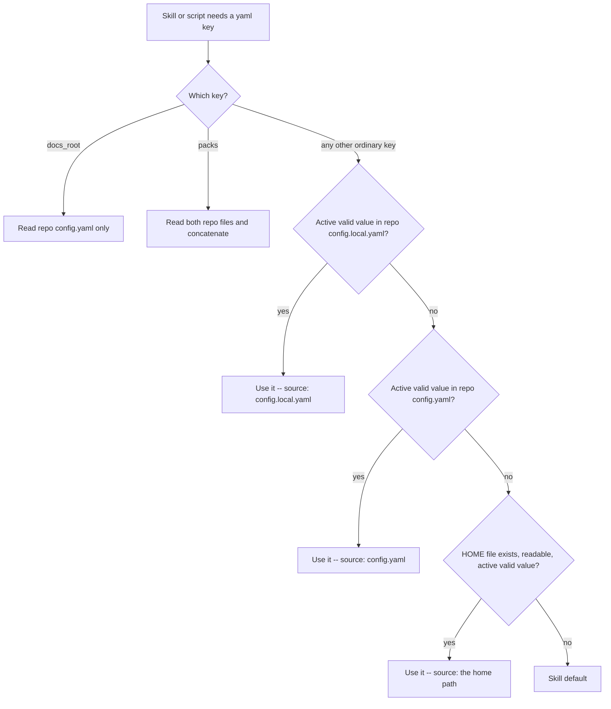

# User Home Config Layer - Plan

## Goal Capsule

- **Objective:** A person's own Compound Engineering preferences follow them into every repository they work in, without any of their colleagues seeing, inheriting, or having to accommodate those preferences — and without a team's committed setting ever being silently overridden.
- **Means:** Add a third, lowest-precedence read layer at `~/.compound-engineering/config.yaml` to the existing ordinary-key cascade (KTD1).
- **Product authority:** This plan governs the read order for ordinary CE yaml keys, what `check-health` reports, and the documented config surface. It supersedes R1 and the "Repo files only" Key Decision of `docs/plans/2026-08-12-002-fix-repo-config-cascade-plan.md`; every other requirement of that plan (R2–R12) stays in force and must still hold when this work lands, with one stated amendment: value resolution for ordinary keys widens from two layers to three (R1), but August R10's first-run trigger for `ce-product-pulse` and `ce-sweep` is deliberately carved out of that widening and still reads "key unset in both layers" verbatim (R12, R12a).
- **Execution profile:** Skill prose duplicated behind a parity fixture, one bash health script, docs and template, mechanical plus behavioral tests. No runtime resolver library, no new script, no new dependency.
- **Open blockers:** None.
- **Tail ownership:** Implementation owns the edits, `bun run test`, and `bun run release:validate` when config-surface wording the validator watches changes. Shipping is a standalone PR to `EveryInc/compound-engineering` off a fresh `feat-user-home-config-layer` branch cut from `main`, preceded by a linked issue.

---

## Product Contract

### Summary

Ordinary CE yaml keys gain a third layer. Resolution becomes repo `.compound-engineering/config.local.yaml`, then repo `.compound-engineering/config.yaml`, then `~/.compound-engineering/config.yaml`. The home file is read-only for CE: nothing in the plugin writes or creates it. `docs_root` stays `config.yaml`-only, and `packs:` keeps its repo-only resolution as a named exception. The canonical rule text in `tests/fixtures/ce-config-layers-rule.md` and its eleven byte-identical copies change together, `skills/ce-setup/scripts/check-health` learns the third layer and a source label that distinguishes it, and the template plus `docs/guides/configuration.md` document the three-layer model.

### Problem Frame

Personal CE preferences have nowhere to live that is both durable and private. A repo's `config.yaml` is committed, so anything set there is imposed on the whole team; `config.local.yaml` is per-checkout and gitignored, so it has to be recreated in every repository and every fresh clone, and it is invisible to anyone setting up a new machine. The user's current workaround is a tracked `config.qchenevier.yaml` in one work repo with `config.local.yaml` symlinked to it — which requires telling every agent about the link, leaks a personal file into a shared repo, and still leaves every other repository with no personal config at all.

What this does not retire, deliberately, follows from KTD1: because the home layer is lowest, it is only ever reached for a key no repo file sets. For any key a team commits in `config.yaml`, the tracked file still wins, and `config.local.yaml` remains the only way to override a committed value in one checkout. So the motivating user's tracked-file-plus-symlink workaround survives for exactly those keys — the ones they want to differ from a team value — which is why a migration helper stays in Deferred to Follow-Up Work rather than being claimed as solved here.

The August 2026 cascade work deliberately deferred this. Its scope boundary listed "user-home config" as out of scope and its Key Decision cited "home-dir config was sketched in March 2026 and never shipped." That was a sequencing judgment, not an architectural rejection: the two-layer cascade had to exist and be pinned by parity tests before a third layer could be added cheaply. It now does, and the March 2026 sketch's precedence ordering (`local > project > global`) is exactly the ordering settled here — so the deferral is being lifted against the same design, minus the durable-state redesign that surrounded it.

### Key Decisions

- **Home is the lowest layer.** (session-settled: user-directed — chosen over letting home beat the team's tracked file, and over a repo-side `pinned:` escape hatch: a team that commits a value keeps it, which is what makes the layer safe to propose upstream.) Governs R1, R12.
- **Every ordinary key, `docs_root` excluded.** (session-settled: user-directed — chosen over an explicit personal-preference allowlist, which is a list to maintain and whose silently-ignored keys surprise users, and over also allowing `docs_root`, which resolves to a writable path inside the repo and was deliberately carved out.) Governs R2, R7.
- **One fixed path, `~/.compound-engineering/config.yaml`.** (session-settled: user-directed — chosen over an env override and over an XDG-style lookup chain: one path to document, and it matches the directory the March 2026 sketch already named.) Governs R3.
- **`packs:` stays repo-only.** (session-settled: user-directed — chosen over teaching `packs-resolve.py` the third file: that script is byte-duplicated across seven skill directories and would need new cross-layer ordering and duplicate-id semantics, and personal packs are already reachable because a pack `source` may be a `~/` path.) Governs R6.
- **Home layer never counts toward pulse/sweep first-run detection.** (session-settled: user-directed — chosen over letting a home value satisfy first-run detection like any other layer: a personal product name or feedback source would otherwise suppress the setup interview in every repo the person opens, so a colleague's pulse report carries the wrong product name and sweep routes against personally-configured Slack channels and GitHub repos.) Governs R12, R12a.

### Requirements

**Read cascade**

- R1. For every ordinary CE yaml key, resolve `<repo-root>/.compound-engineering/config.local.yaml`, then `<repo-root>/.compound-engineering/config.yaml`, then `~/.compound-engineering/config.yaml`. The first active (non-commented) value wins. This supersedes R1 of `docs/plans/2026-08-12-002-fix-repo-config-cascade-plan.md`, which forbade reading any user-home CE config.
- R2. The home file may set every ordinary key. `docs_root` is never read from it, exactly as it is never read from `config.local.yaml`.
- R3. The home file's location is the literal path `~/.compound-engineering/config.yaml`, where `~` is the invoking user's home directory. No environment-variable override, no XDG lookup chain, no per-project subdirectory.
- R3a. `~` means `$HOME` as the running process sees it — nothing resolves the invoking account's home by any other route (no `getpwuid`, no `/etc/passwd` lookup, no `~` expansion by a shell that did not inherit the same `HOME`). The consequence is stated plainly in the docs: a CI job, a container, a `sudo` invocation that resets or drops `HOME`, and a launchd or daemon context each see whatever `HOME` they were given, which is usually not the developer's home, and an unset `HOME` means there is no home layer at all. CE neither creates nor requires the directory, so all of those contexts simply resolve two layers exactly as they do today.
- R4. A missing `~/.compound-engineering/` directory, a missing file, an unreadable file, and a file the flat reader cannot parse a value out of are all one outcome: **this layer supplies nothing**. None of them is an error, none of them stops a skill, none of them is a project issue. The rule is stated once, in the canonical block's skip clause ("missing files are skipped"), extended to cover a missing directory and an unreadable file; the malformed case needs no clause of its own because the deliberately-not-a-YAML-parser reader already yields nothing from text it does not recognise, which is the same shape as an unset key. A single **invalid value** is different and unchanged: it continues to the next layer under the `**Win**` clause, and the last layer's invalid value falls to the skill default. In `check-health`: an absent directory or file is reported as an absent read layer, an unreadable or unparseable file is reported as a skipped layer with the reason, and a resolved invalid value is reported as today's warning naming the layer that carried it — none of the four increments `project_issues`.
- R5. Structured ordinary keys (lists and maps such as `work_engine_preferences` and `feedback_sources`) replace the whole key at whichever layer first sets them, including when that layer is the home file and the value is empty. No deep merging across layers.
- R6. `packs:` resolves from the repo files only and is documented as a named exception to R1. A personal pack is reached by giving a repo-file `packs:` entry a `~/`-rooted `source`.
- R7. Keys whose meaning is repository-specific still resolve as ordinary keys under R1, so a home-level value applies in every repo. `docs/guides/configuration.md` warns that a home-level value is only sensible when it is meaningful in *every* repository, and names the two shapes that are not: repo-relative paths (`sweep_state_path`, which is only safe machine-wide as a `/tmp` path) and per-project identity or routing keys (`feedback_sources`, the `pulse_*` identity keys such as `pulse_product_name`, and `ce_promote_spiral_optout`, which the template scopes to "this project").

**Writes and setup**

- R8. No skill and no script writes, creates, seeds, or migrates `~/.compound-engineering/config.yaml`. `/ce-setup` never creates it and never offers to. Pulse, sweep, and promote keep persisting their keys to repo `config.local.yaml` per R10 of the August plan.
- R9. `/ce-setup` reports the home file as a present or absent read layer alongside the two repo layers. Its absence is never a project issue. Setup's create offer, its never-overwrite guarantee, and its gitignore offer stay scoped to the repo files.
- R9a. A person learns the layer exists without CE creating anything: `/ce-setup`'s health output names `~/.compound-engineering/config.yaml` as a read layer and says "absent" when it is not there, and the setup guide plus `docs/guides/configuration.md` state the path, what belongs in it, and that the operator creates it by hand. Setup does not offer to create it (R8). For someone whose preferences currently sit in a repo's `config.local.yaml`, the documented migration is one line: copy the personal keys into `~/.compound-engineering/config.yaml` and delete them from the repo file. Nothing automates that copy.

**Health, docs, and parity**

- R10. `check-health` reads all three layers everywhere it resolves anything today, and labels the winning layer with a form that distinguishes the home file from the two repo files. The honest scope of that promise is exactly what the script resolves: the one ordinary scalar `work_engine_mode`, the structured key `work_engine_preferences`, `docs_root` (repo-only, with a home value reported as ignored), and the retired-key and `work_engine_target`/`work_engine_model` migration scans. The keys most likely to surprise someone — `plan_model`, `brainstorm_model`, `cross_model_peer`, `cross_model_review_mode`, `plan_output`, `brainstorm_output`, `ideate_output` — are resolved by agents following prose, not by `check-health`, so they are documented but **not** health-reported. Teaching health to resolve and label them is named in Deferred to Follow-Up Work rather than promised here.
- R10a. A retired key found **only** in the home file is reported with a warning that names `~/.compound-engineering/config.yaml` as where it lives, and does **not** increment `project_issues`. Today the retired-key scan and the `work_engine_target`/`work_engine_model` migration scan increment `project_issues` unconditionally and name the key but never the file; extending them to the home file without this carve-out would tell someone whose personal config still carries `plan_use_fable` that every repository they visit is unhealthy, including ones they have no way to fix. A retired key present in either repo file keeps counting as a project issue exactly as today.
- R11. The canonical rule in `tests/fixtures/ce-config-layers-rule.md` states the three-layer cascade and is byte-identical in all eleven consumers. The revised block fits inside the 8000-byte CRLF-adjusted `SKILL.md` budget for each of the four consumer `SKILL.md` files, the tightest of which has 133 bytes of headroom.
- R12. R2–R12 of `docs/plans/2026-08-12-002-fix-repo-config-cascade-plan.md` continue to hold: the repo-file order is unchanged, `docs_root` stays `config.yaml`-only, setup still creates `config.yaml` and never `config.local.yaml`, and gitignore status still does not affect resolution. Value resolution for ordinary keys widens from two layers to three, per R1 — including for `pulse_product_name` and `feedback_sources`, which a home-file value can now supply once a run proceeds past first-run routing. First-run detection deliberately does not widen alongside it (R12a): August R10's first-run trigger, "key unset in **both** layers," continues to hold verbatim for `ce-product-pulse` and `ce-sweep`. Pulse, sweep, and promote still *write* only to repo `config.local.yaml`. Pulse and sweep specifically now *read* their first-run status from only the two repo layers (R12a is scoped to those two skills, not to promote's own dismissal-based first-run offer), even though they read the ordinary-key value itself through the full three-layer cascade. Had first-run detection widened along with value resolution, a personal `pulse_product_name` or `feedback_sources` in the home file would have suppressed the first-run interview in every repository that person opens: `/ce-product-pulse` could title a colleague's report with another product's name, and `/ce-sweep` could route against personally-configured Slack channels and GitHub repositories, including `approved: true` entries that stand as authorization for unattended source-side writes. R12a's carve-out is what prevents that; it is documented (R7's warning, U3) and pinned by a test (U4).
- R12a. Value resolution and first-run detection diverge for `ce-product-pulse` and `ce-sweep`. `pulse_product_name`, `feedback_sources`, and every other ordinary key those skills read resolve through the full three-layer cascade of R1 — the home file can supply their *value* like any other ordinary key, once a run has already passed the first-run check. Deciding whether to run the first-run interview is a separate check that does not widen: it asks only whether the key is unset in the two repo layers, `config.local.yaml` and `config.yaml`, exactly as August R10 defined it, and a home-file value never counts as satisfying that check. Concretely: if neither repo file sets `pulse_product_name`, Phase 1 (the first-run interview) runs whether or not the home file sets it — the home value never gets a chance to silently stand in for the interview. The prose that states each check must say so explicitly rather than deferring to "the cascade" or "the ordinary-key rule above" as shorthand, because after this plan those phrases mean three layers and would misstate the first-run check if reused for it (U1).

### Actors

- A1. An individual using CE across several repositories, some of them shared with colleagues.
- A2. A team that commits `.compound-engineering/config.yaml` and expects its values to hold for everyone.
- A3. An agent running a CE skill that needs one yaml key.

### Key Flows

- F1. Personal default in an unconfigured repo
  - **Trigger:** A3 resolves `plan_output` in a repo with no `.compound-engineering/` directory.
  - **Steps:** Both repo files are absent and skipped. The home file sets `plan_output: html`.
  - **Outcome:** HTML, in every repo the person works in, with nothing committed anywhere.
- F2. Team value beats a personal one
  - **Trigger:** A3 resolves the same key in A2's repo, which commits `plan_output: md`.
  - **Steps:** No local file. `config.yaml` sets the key; resolution stops there and never reaches the home file.
  - **Outcome:** Markdown. A2's committed choice is what runs, which is the property that makes the layer safe to ship upstream.
- F3. Health report on a machine with a home config
  - **Trigger:** A1 runs `/ce-setup`.
  - **Steps:** Health reports which of the three layers exist and, for each key it actually resolves (`work_engine_mode`, `work_engine_preferences`, `docs_root`, the retired-key scans), which layer supplied the winning value.
  - **Outcome:** A1 can see that a surprising `work_engine_mode` came from their home file rather than from the repo. A surprising `plan_model` or `cross_model_peer` is not shown, because health does not resolve those keys at all — the guide tells A1 where they can be set; the report does not. Setup writes nothing to `$HOME`.

### Acceptance Examples

- AE1. Home-only ordinary default. Covers R1, F1.
  - **Given:** Neither repo config file exists and `~/.compound-engineering/config.yaml` has `plan_output: html`.
  - **When:** `ce-plan` resolves output mode.
  - **Then:** It uses HTML, not the markdown skill default.
- AE2. Tracked beats home. Covers R1, R12, F2.
  - **Given:** `config.yaml` has `plan_output: md` and the home file has `plan_output: html`.
  - **When:** `ce-plan` resolves output mode.
  - **Then:** It uses markdown.
- AE3. Local beats home with no tracked file. Covers R1.
  - **Given:** `config.local.yaml` has `work_engine_mode: off` and the home file has `work_engine_mode: prefer`.
  - **When:** `check-health` resolves the engine mode.
  - **Then:** The mode is `off`, sourced from `config.local.yaml`.
- AE4. `docs_root` ignores home. Covers R2.
  - **Given:** The home file has `docs_root: ~/ce-artifacts` and `config.yaml` sets no `docs_root`.
  - **When:** Any skill resolves the artifact root.
  - **Then:** The root is the default `docs`, and health reports the home `docs_root` as ignored rather than acting on it.
- AE5. Absent home directory is not an error. Covers R4.
  - **Given:** `~/.compound-engineering/` does not exist.
  - **When:** `check-health` runs and any skill resolves any key.
  - **Then:** Behavior is byte-identical to today's two-layer behavior, with no warning and no project issue.
- AE6. Unreadable or malformed home file. Covers R4.
  - **Given:** `~/.compound-engineering/config.yaml` exists but is not readable, or contains text the flat reader cannot parse a value out of.
  - **When:** `check-health` runs.
  - **Then:** Resolution continues to the skill default, health does not crash, and the condition is reported as a skipped layer rather than counted as a project issue.
- AE7. Invalid home scalar falls to the default. Covers R4.
  - **Given:** Neither repo file sets `work_engine_mode` and the home file sets it to an invalid value such as `everything`.
  - **When:** `check-health` resolves the engine mode.
  - **Then:** The mode is the native default, and the warning names `~/.compound-engineering/config.yaml` as the source of the invalid value.
- AE8. Empty home list replaces nothing above it. Covers R5.
  - **Given:** `config.yaml` sets a non-empty `work_engine_preferences` and the home file sets `work_engine_preferences: []`.
  - **When:** `check-health` resolves the key.
  - **Then:** The repo list wins, because resolution stops at the first layer that sets the key and the home file is last.
- AE9. Setup leaves `$HOME` alone. Covers R8, R9.
  - **Given:** No `~/.compound-engineering/` directory.
  - **When:** The operator accepts every offer `/ce-setup` makes.
  - **Then:** `.compound-engineering/config.yaml` and `config.example.yaml` exist in the repo, and nothing was created under `$HOME`.
- AE10. Personal packs via a home-rooted source. Covers R6.
  - **Given:** The home file lists `packs:` entries and `config.yaml` does not.
  - **When:** Pack discovery runs.
  - **Then:** No packs resolve from the home file; the documented route is a repo-file `packs:` entry whose `source` is a `~/` path.
- AE11. Home-only value does not suppress first-run detection. Covers R12, R12a.
  - **Given:** Neither repo file sets `pulse_product_name` and the home file sets it.
  - **When:** Pulse decides whether this is a first run.
  - **Then:** The key is unset in both repo layers, so the first-run interview still runs — first-run detection does not count the home layer, even though a later value read in the same run would find `pulse_product_name` there. This is R12a's carve-out: it closes the silent-suppression risk specifically, but R7's warning against putting per-project identity keys in the home file still stands, since a home value there still means re-answering the same interview in every repository that has none of its own, rather than the durable per-machine default the person wanted.
- AE12. Retired key in a personal config is not a project issue. Covers R10a.
  - **Given:** A retired key (`plan_use_fable`, or `work_engine_target`) is set only in the home file.
  - **When:** `check-health` runs in any repo.
  - **Then:** The migration warning names `~/.compound-engineering/config.yaml`, and `project_issues` is unchanged.

### Success Criteria

- A person with one `~/.compound-engineering/config.yaml` gets their preferences in **a repo that pins nothing**, and commits nothing to reach that. Keys a team does commit are untouched by the home file by design, so the per-checkout `config.local.yaml` route (and any workaround built on it) remains necessary for those and is not retired by this work.
- No committed team value changes behavior as a result of this work.
- A colleague who never creates the home directory sees behavior identical to today, including in `check-health` output.
- The change reads as a self-contained upstream contribution: one cascade layer, one fixture, one script, one docs surface.

### Scope Boundaries

**In scope:** the third read layer for ordinary keys; `check-health` resolution and the newly-visible per-key source labels; the canonical rule fixture and its eleven copies; the key-specific satellite prose across `skills/` that restates the read order in its own words; the parity test's pinned clauses; the config template, `docs/guides/configuration.md`, `docs/guides/ce-setup.md`, and the AGENTS.md config-maintenance rule; behavioral tests with a sandboxed `HOME`.

**Out of scope, deliberately:**

- `packs:` resolution (R6) — repo-only, documented exception.
- `docs_root` (R2) — stays `config.yaml`-only.
- Any relocation of CE scratch, todos, pack caches, or durable state out of the repo or `/tmp`. This plan creates the first CE-owned path under `$HOME` and creates nothing else there.
- Deep merging of lists or maps across layers (R5).
- An environment-variable override or XDG lookup chain (R3).
- Any code path that writes, creates, or migrates the home file (R8).
- A shared runtime config resolver. KTD2 of the August plan stands: skills cannot import siblings, and the rule is duplicated prose, not a library.

### Deferred to Follow-Up Work

- A `/ce-setup` mode that shows a machine-wide summary of the home layer across repos.
- A documented migration helper for people who, like the motivating user, currently keep a personal config as a tracked file plus symlink. R9a's one-line manual migration covers the simple case; a helper is still wanted for the keys a team commits, where the tracked file wins and the workaround survives.
- Extend `check-health` to resolve and label the model and peer keys (`plan_model`, `brainstorm_model`, `cross_model_peer`, `cross_model_review_mode`, and the `*_output` keys) so the health report can name the layer for the settings most likely to surprise someone. Today it resolves only `work_engine_mode`, `work_engine_preferences`, and `docs_root`, which is why R10 promises labels only for those.

### Sources

- `docs/plans/2026-08-12-002-fix-repo-config-cascade-plan.md` — the plan this one amends; R1 and the "Repo files only" Key Decision are superseded, KTD2 (no shared runtime resolver) is honored.
- `docs/brainstorms/2026-03-25-config-storage-redesign-requirements.md` — R2 proposed the same `local > project > global` precedence; R17's env/XDG fallback chain and the surrounding durable-state redesign are not adopted.
- `tests/fixtures/ce-config-layers-rule.md` and `tests/config-layers-rule-parity.test.ts` — the canonical block, its hard-coded `CONSUMERS` list, and the clause-pinning test that must be updated with it.
- `skills/ce-setup/scripts/check-health` — `read_flat_config_value`, `has_flat_config_key`, `resolve_ordinary_scalar`, `resolve_structured_layer`, `read_work_engine_preferences`, `resolve_docs_root`, the internal `ordinary_source` label, the `in_repo` branch that composes the two repo paths, and the retired-key / `work_engine_target` migration scans. The script resolves exactly one ordinary scalar today (`work_engine_mode`) plus `work_engine_preferences`, `docs_root`, and the packs section.
- `tests/skills/ce-setup-check-health.test.ts` — sets `HOME: cwd`, where `cwd` is the sandbox repo root, and sets `CODEX_HOME` explicitly; U4 must change the `HOME` choice, because as written `$HOME/.compound-engineering/config.yaml` and `<repo-root>/.compound-engineering/config.yaml` are the same file.
- `tests/codex-skill-prompt-budget.test.ts` — the 8000-byte CRLF-adjusted `SKILL.md` bound and its ratchet-down `OVER_BUDGET` set.
- `docs/guides/configuration.md` — the two-file framing, the packs concatenation paragraph, and the options table that this work updates.

---

## Planning Contract

### Key Technical Decisions

- KTD1. **Third layer, appended at the bottom of the existing cascade.** (session-settled: user-directed — chosen over letting home beat the team's tracked file, and over a repo-side `pinned:` escape hatch: a team that commits a value keeps it, which is what makes the layer safe to propose upstream.) Governs R1, R12. Mechanically this means every resolver and every prose rule appends one more step after `config.yaml`; no existing comparison or precedence test changes its expected outcome.
- KTD2. **Extend the Read clause; do not add a bullet.** The canonical block's `**Read**` clause names three files in one sentence instead of gaining a fourth bullet. `skills/ce-brainstorm/SKILL.md` and `skills/ce-product-pulse/SKILL.md` have 133 and 135 bytes of CRLF-adjusted headroom under the 8000-byte bound, so a bullet-sized growth would push both over and force either a restructure of two skills or two new `OVER_BUDGET` entries — and that set is a ratchet that never takes new names. Rewording tightens the block enough to absorb the third path. Governs R11. The margin is thin and measured: a terse three-layer rewrite that keeps the home path, the readability skip, and the new `packs:` exception grows the block by roughly 114 CRLF-adjusted bytes, against `skills/ce-brainstorm/SKILL.md` at 7867 and `skills/ce-product-pulse/SKILL.md` at 7865 bytes — about 19 bytes of slack, which one extra qualifier spends. **Decided fallback if it does not fit:** shrink the `packs:` exception inside the block to a bare mention (`packs:` is repo-only) and document the `~/`-rooted `source` route only in `docs/guides/configuration.md`. Restructuring unrelated skills and adding a name to `OVER_BUDGET` are both out — the Definition of Done forbids the second.
- KTD3. **One fixed path resolved from `$HOME`, with no new helper.** (session-settled: user-directed — chosen over an env override and over an XDG-style lookup chain: one path to document, and it matches the directory the March 2026 sketch already named.) Governs R3, R3a. `~` is `$HOME` as the process sees it, with no `getpwuid` or `/etc/passwd` fallback. **The home layer is independent of the repo.** `check-health` composes the two repo paths inside its `if [ "$in_repo" = "yes" ]` branch; the home path is composed from `$HOME` *before and outside* that branch, so it resolves and is reported even when `git rev-parse --show-toplevel` fails and there is no checkout at all. This matches the canonical block, which keys only `<repo-root>` off `git rev-parse` and leaves the home file readable regardless, and it matches the Definition of Done, which states the three-layer order with no repo qualifier. Prose tells agents the literal `~/` path.
- KTD4. **Home resolution reuses the repo's own absence semantics.** Governs R4. `read_flat_config_value` is guarded by the same `[ -f "$file" ]` test the repo layers use, extended to require readability, so a missing directory, a missing file, and an unreadable file all collapse into "layer skipped." The deliberately-not-a-YAML-parser awk one-liner stays as is: a malformed file simply yields no value, which is already the shape of an unset key.
- KTD5. **The layer label becomes visible, and is path-shaped for the home layer only.** Governs R10. `ordinary_source` exists today but is **internal**: it is set by `resolve_ordinary_scalar` and read exactly once, in the `work_engine_mode` invalid-value branch, and never printed. The only `from ${source}` line the script emits is the `docs_root` artifact-root line. So this work does not extend an existing visible label — it makes the ordinary-key label visible for the first time, where `work_engine_mode` and `work_engine_preferences` are reported. The two repo layers keep their bare filenames `config.local.yaml` and `config.yaml`; the home layer takes the path-shaped `~/.compound-engineering/config.yaml`, which a bare `config.yaml` could not be distinguished from. The `docs_root` line's existing label and the assertions on it are untouched.
- KTD6. **The one hard-coded local-to-tracked continuation generalizes to a layer list.** Governs R4, R10. There is exactly one: the `work_engine_mode` invalid-value fallback, which today re-reads the tracked file only when `ordinary_source` was `config.local.yaml`. With three layers that special case becomes a loop over the ordered layers, so an invalid value in any layer continues to the next and the final fallback stays the native default, with the warning naming the layer that carried the bad value. (An earlier draft of this plan also named a `resolve_review_scope` function and a `cross_model_code_review_scope` key. Neither exists in `skills/ce-setup/scripts/check-health` or anywhere else on this branch; the review-scope keys are resolved by skill prose, not by the health script.)
- KTD7. **`packs:` is left alone and named as an exception in prose.** (session-settled: user-directed — chosen over teaching `packs-resolve.py` the third file: that script is byte-duplicated across seven skill directories and would need new cross-layer ordering and duplicate-id semantics, and personal packs are already reachable because a pack `source` may be a `~/` path.) Governs R6. `packs:` is also the one key whose repo layers *concatenate* rather than override, so folding a third layer in would mean deciding concatenation order and duplicate-id behavior across a trust boundary — work this plan does not take on.
- KTD8. **`docs_root` keeps its own rule block untouched.** Governs R2. The `<!-- ce-docs-root -->` block already says `config.yaml` only; the home layer adds nothing to it. The ordinary-key block keeps its existing "Do not use this rule for `docs_root`" clause, which the parity test pins. `resolve_docs_root` gains only the reporting of an ignored home `docs_root`, mirroring `docs_root_local_ignored`.

### High-Level Technical Design

The new layer is strictly additive at the bottom. Every path that terminates in `useLocal`, `useTracked`, `repoOnly`, or `packsOnly` behaves exactly as it does today; only runs that reach the skill default today can now land on `useHome` instead.

### Assumptions

- No assumption is made that `$HOME` is set, or that it points at the developer's own home. Where it is unset, or set to something else by CI, a container, `sudo`, or a launchd/daemon context, the layer is simply absent — which R3a documents and R4 already makes a non-event.

### Implementation Constraints

- Cross-skill file references are forbidden. Duplicate the rule block; never `@`-include it.
- `skills/ce-setup/references/config-template.yaml` and `.compound-engineering/config.example.yaml` stay byte-identical.
- No manual version bumps in plugin or marketplace manifests.
- Tests must never read the developer's real home directory; every case that exercises the home layer sets `HOME` into its sandbox — and to a directory that is **not** the sandbox repo root, or the home and repo config paths collide (U4).
- The revised canonical block must leave every consumer `SKILL.md` under the 8000-byte CRLF-adjusted bound, and must not add a name to `OVER_BUDGET`. Concretely: the block may grow by at most **133 CRLF-adjusted bytes** over the current fixture, that being `skills/ce-brainstorm/SKILL.md`'s headroom. KTD2 names the decided fallback if a draft exceeds it.

### Sequencing

Strictly U1 → U2 → U3 → U4. U1 first: the canonical text is what every other unit describes or asserts. U2 next, because the health script's per-key layer labels are the thing U3's docs describe — the documented label has to match what the script prints, not the other way round. U3 then. U4 closes on U2's behavior and is checked last.

---

## Implementation Units

### U1. Rewrite the canonical cascade rule and propagate it

**Goal:** The one canonical statement of the ordinary-key cascade names three layers, is byte-identical in all eleven consumers, fits every consumer's prompt budget — and no file anywhere in `skills/` still restates a two-file order in its own words for a *value* read. The one deliberate exception is pulse and sweep's first-run-detection prose, which must keep naming only the two repo layers (R12a) — this unit is also where that carve-out gets written down precisely, not left to a phrase like "the cascade" that now means three.

**Requirements:** R1, R2, R4, R5, R6, R11, R12, R12a

**Dependencies:** none

**Files:**
- `tests/fixtures/ce-config-layers-rule.md`
- `skills/ce-plan/references/output-mode.md`
- `skills/ce-brainstorm/SKILL.md`
- `skills/ce-ideate/SKILL.md`
- `skills/ce-product-pulse/SKILL.md`
- `skills/ce-sweep/SKILL.md`
- `skills/ce-commit-push-pr/references/compose.md`
- `skills/ce-commit-push-pr/references/apply-and-handoff.md`
- `skills/ce-work/references/execution-engines.md`
- `skills/ce-promote/references/spiral-cli.md`
- `skills/ce-code-review/references/cross-model-review.md`
- `skills/ce-doc-review/references/cross-model-review.md`
- `tests/config-layers-rule-parity.test.ts`

Plus the satellite prose that restates the order *outside* the delimited block, and is what an agent actually follows for these keys:
- `skills/ce-work/references/execution-engines.md` — the `work_engine_mode` / `work_engine_preferences` sentence ("independently from the two repo files (`config.local.yaml` then `config.yaml`)")
- `skills/ce-code-review/references/cross-model-review.md` — three restatements: `cross_model_review_mode`, `cross_model_peer`, and the `cross_model_model` / `cross_model_effort` line, each saying "the two repo CE config files"
- `skills/ce-doc-review/references/cross-model-review.md` — the same three restatements
- `skills/ce-plan/references/reasoning-elevation.md` and `skills/ce-brainstorm/references/reasoning-elevation.md` — `plan_model` / `brainstorm_model`: "apply the ordinary-key rule (`config.local.yaml` then `config.yaml`)"
- `skills/ce-brainstorm/references/output-mode.md` (line 7) and `skills/ce-ideate/references/output-mode.md` (line 11) — each has *two* restatements, not one: the already-known `brainstorm_output` / `ideate_output` line ("first active … in `config.local.yaml` then `config.yaml`") **and** a second, easy-to-miss sentence a few lines above it, "Read both files when they exist." Both need the three-layer rewrite; fixing only the first leaves the second stating a two-file model right next to it.
- `skills/ce-plan/references/output-mode.md` — its step 3 already defers ("apply the ordinary-key rule below") and needs no change; confirm that during the sweep rather than assuming it.
- `skills/ce-ideate/references/post-ideation-workflow.md` (around line 120) — "a user who wants HTML for both sets both keys in CE config (`config.local.yaml` then `config.yaml`)"; an ordinary value-read restatement, widens to three layers like the others.
- `skills/ce-product-pulse/references/interview.md` (line 3) — "Subsequent runs re-read those keys from the local file first, then from `config.yaml`."; an ordinary value-read restatement (this file carries no first-run-detection sentence of its own — that lives in `SKILL.md`), widens to three layers.
- `skills/ce-sweep/references/interview.md` (line 3) — this one sentence mixes both kinds and they must be edited differently: "Loaded by `SKILL.md` when `ce-sweep` runs with `feedback_sources` unset in both the local override file and `config.yaml`" is the first-run-detection half and is **already correct under R12a** — leave it naming only the two repo layers. "Later runs re-read those keys from the local file first, then from `config.yaml`" is the value-read half a sentence later, and that half widens to three layers.
- `skills/ce-product-pulse/SKILL.md` — already in the Files list above as a canonical consumer, but it also carries two satellite sentences *outside* the delimited block that need R12a-aware edits, not a copy-paste: the Phase 0 routing sentence ("Run Phase 1 … when `pulse_product_name` is unset after cascade (the ordinary-key rule above) …") is first-run detection and must be reworded to name only the two repo layers instead of deferring to "the ordinary-key rule above" (which is now three layers and would misstate the check); the Phase 2 re-read sentence ("re-apply the ordinary-key rule (local then tracked) from the repo root …") is a value read and widens to three layers.
- `skills/ce-sweep/SKILL.md` — same situation as pulse's `SKILL.md`: the Phase 0 routing sentence ("Route to Phase 1 on `feedback_sources` unset after cascade (a first run) …") is first-run detection and must be reworded to name only the two repo layers rather than "cascade."

**Approach:**
1. Rewrite the fixture's opening sentence so it no longer says the keys come from "the two repo files," and extend the `**Read**` clause to name the repo local file, the repo tracked file, and `~/.compound-engineering/config.yaml` in that order, per KTD2 — one sentence, no new bullet.
2. Extend the skip clause so a missing home directory, missing file, or unreadable file is skipped like a missing repo file (R4), and keep "Gitignore does not change resolution" verbatim.
3. Keep the `**Win**` clause's existing scalar, invalid-value, and present-list semantics unchanged; they already describe R5 correctly once a third layer exists.
4. Add the `packs:` exception to the existing `**Do not**` clause alongside `docs_root`, naming the `~/`-rooted `source` route (R6).
5. Paste the revised block, byte-for-byte, into all eleven consumers listed above. Keep the block within the 133-byte growth ceiling in Implementation Constraints; if a draft exceeds it, take KTD2's decided fallback rather than inventing a new one.
6. Rewrite every satellite restatement listed above so it either names the three-layer rule or — preferred, because it cannot drift again — defers to "the ordinary-key rule above" instead of repeating a file list. This step is not optional polish: `plan_model`, `brainstorm_model`, `cross_model_peer`, and the `*_output` keys are exactly the preferences that motivate this feature, and a reader who follows their key-specific prose would never reach the home file no matter how correct the delimited block is.
7. Update `tests/config-layers-rule-parity.test.ts`: the clause-pinning test's expectations must move from the current two-file phrasing to the new clauses, including a pin on the home path and on the `packs:` exception.
8. Apply R12a's carve-out to the pulse and sweep first-run sentences, and do it as a distinct pass from step 6 rather than folding it in — step 6's "defer to the rule above" instruction is exactly wrong here and would misstate the check. In `skills/ce-product-pulse/SKILL.md` and `skills/ce-sweep/SKILL.md`, reword the Phase 0 routing sentence so it states plainly that first-run detection checks the two repo layers only, names `config.local.yaml` and `config.yaml`, and says the home layer is read for the value but never counts toward this check — do not phrase it as "unset after cascade" or "unset after the ordinary-key rule above," since after this plan lands both phrases mean three layers. Leave `skills/ce-sweep/references/interview.md`'s first-run clause as-is (it already says "both," correctly). Everywhere else in these same files and reference docs that a `pulse_*` or `feedback_sources` value is *read* rather than a first-run decision made — pulse's Phase 2 re-read sentence, and the value-read half of both `references/interview.md` files — extend to the three-layer rule exactly like every other satellite restatement in this unit.

**Patterns to follow:** The existing delimited-block plus parity-fixture pattern; the block is the implementation, not a grep target.

**Test scenarios:**
- The fixture defines exactly one delimited block, with the start and end markers appearing once each.
- Each of the eleven consumers contains the revised block verbatim; removing it from any one of them fails the test with that file named.
- The pinned clauses include the home path, the three-file read order, "Gitignore does not change resolution", "invalid value continues to the next layer", "including an empty list or map", and both the `docs_root` and `packs` exceptions.
- A scan of the **whole `skills/` tree** — not only the eleven pinned consumers — finds no two-file phrasing left for a *value* read: no "two repo files", no "two repo CE config files", no "`config.local.yaml` then `config.yaml`" outside a three-layer sentence. The scan carries a named, fixed exception list for R12a's first-run sentences (the Phase 0 routing sentence in `ce-product-pulse/SKILL.md`, the Phase 0 routing sentence in `ce-sweep/SKILL.md`, and the first-run clause of `ce-sweep/references/interview.md`) — those are expected and required to keep naming only the two repo layers, and the scan must not flag them; any two-file phrasing found *outside* that named list still fails the scan. The scan is the assertion; the eleven-consumer parity check does not subsume it.
- Each of the four consumer `SKILL.md` files is at or under 8000 CRLF-adjusted bytes, and `OVER_BUDGET` gains no new name.
- The cross-model peer-resolution test still holds: both `cross-model-review.md` files contain "invalid value continues to the next layer" and neither contains "first active value wins".
- Pulse and sweep first-run wording explicitly keys off "unset in the two repo layers" (or equivalent explicit two-layer phrasing), never off "unset after cascade," "unset after the ordinary-key rule above," or a missing file — the phrase must name the layers, not defer to language that now means three (R12a).
- The value-read sentences next to those first-run sentences — pulse's Phase 2 re-read, and the second half of both `references/interview.md` files — do name three layers, so the two kinds of sentence read differently from each other in the same file. A test that only checked "the file mentions the home path somewhere" would pass even if the first-run sentence had wrongly grown a third layer; the assertion must check each sentence, not just the file.

**Verification:** `tests/config-layers-rule-parity.test.ts` and `tests/codex-skill-prompt-budget.test.ts` are green, and a diff of any consumer's block against the fixture is empty.

---

### U2. Teach `check-health` the third layer

**Goal:** Every ordinary-key resolver in the health script reads the home file last and reports which of the three layers won.

**Requirements:** R1, R2, R3a, R4, R5, R10, R10a, R12

**Dependencies:** U1

**Files:**
- `skills/ce-setup/scripts/check-health`

**Approach:**
1. Compose the home config path once from `$HOME`, **before and outside** the `if [ "$in_repo" = "yes" ]` branch that composes `local_config_path` and `tracked_config_path` from `git rev-parse --show-toplevel`, so the home layer resolves and is reported even with no checkout (KTD3). Make the ordinary-key section operate over an ordered list of the available paths rather than two named variables.
2. Extend `resolve_ordinary_scalar` to try the third layer after the tracked file, setting `ordinary_source` to the home label from KTD5 and leaving the two existing labels untouched.
3. Generalize the `work_engine_mode` invalid-value fallback from its hard-coded "if the source was `config.local.yaml`, re-read the tracked file" into a loop over the ordered layers, so a bad value in any layer continues to the next, the final fallback is still the native default, and the warning names the layer that carried the bad value (KTD6). This is the *only* such continuation in the script.
4. Emit the per-key layer label where `work_engine_mode` and `work_engine_preferences` are reported — bare `config.local.yaml` / `config.yaml` for the repo layers, `~/.compound-engineering/config.yaml` for the home layer. This label is new output: `ordinary_source` is internal today and the script's only `from ${source}` line belongs to `docs_root` (KTD5).
5. Extend `resolve_structured_layer` so a present key — including an empty list or map — in the home file wins when neither repo file sets it, and let `read_work_engine_preferences` run against whichever file `structured_layer` selected, including the home file.
6. Extend the retired-key scan and the `work_engine_target` / `work_engine_model` migration scan to the home file, so a retired key hiding in a personal config is reported rather than silently ignored — but a key found **only** in the home file names the home path in its warning and must not increment `project_issues` (R10a). Today both scans increment unconditionally and name no file; that is what changes.
7. Guard every home read on file existence and readability; a missing directory, missing file, or unreadable file skips the layer without a warning and without incrementing `project_issues` (R4).
8. In `resolve_docs_root`, report a `docs_root` found in the home file as ignored, mirroring `docs_root_local_ignored`, and never let it supply a value (R2).
9. Add the home file to the layer-presence report as present or absent, never as a project issue (R9), and make that report reachable outside a checkout too.

**Patterns to follow:** The existing `docs_root_local_ignored` reporting shape; the deliberately-not-a-YAML-parser posture of `read_flat_config_value`; the existing `from ${source}` detail line.

**Test scenarios:** Enumerated in U4 — this unit's behavior is proven there.

**Execution note:** The bash resolvers are the one place in this change where a cascade is actually implemented rather than described; they land before the docs unit so the documented labels match what the script prints. This is why Sequencing is U1 → U2 → U3 → U4 rather than treating U2 and U3 as independent.

**Verification:** Running the script in a checkout with a home config, a repo config, or neither produces the layer report and the per-key source labels R10 describes; running it **outside any git checkout** still reports the home layer and resolves from it; and a checkout with no `~/.compound-engineering/` directory produces output identical to today's.

---

### U3. Document the three-layer model

**Goal:** The template header, the configuration guide, the setup guide, and the AGENTS.md maintenance rule all describe three layers, the two exceptions, and the fact that CE never writes the home file.

**Requirements:** R2, R3, R3a, R6, R7, R8, R9, R9a, R10, R12, R12a

**Dependencies:** U1, U2

**Files:**
- `skills/ce-setup/references/config-template.yaml`
- `.compound-engineering/config.example.yaml`
- `docs/guides/configuration.md`
- `docs/guides/ce-setup.md`
- `skills/ce-setup/SKILL.md`
- `AGENTS.md`

**Approach:**
1. Rewrite the template header's opening comment block: the copy target is still repo `config.yaml`; `config.local.yaml` is still the per-checkout override; add the home file as the personal lowest layer that CE reads and never writes, and keep the `docs_root` carve-out sentence.
2. Regenerate `.compound-engineering/config.example.yaml` so it stays byte-identical to the template.
3. In `docs/guides/configuration.md`, restate the cascade once under "How keys resolve" with all three layers, keep the `docs_root` line, and add the `packs:` exception with the `~/`-rooted `source` route next to the existing concatenation paragraph.
4. Add the R7 warning to the same guide: every ordinary key resolves from the home file, so a home-level value only makes sense when it is meaningful in *every* repository. Name both failing shapes — repo-relative paths (`sweep_state_path`, safe machine-wide only as a `/tmp` path) and per-project identity or routing keys (`feedback_sources`, the `pulse_*` identity keys, `ce_promote_spiral_optout`). Do not write that `pr_teaching_archive` names a path: it is a `true`/`false` toggle.
5. Add a short "Personal defaults" section to the guide covering the fixed path, what `~` resolves to (`$HOME` as the process sees it, so CI, containers, `sudo`, and daemons usually see no home layer — R3a), what belongs there, that nothing in CE writes or creates it, how to create it by hand, the one-line migration from a repo `config.local.yaml` (copy the personal keys up, delete them from the repo file — R9a), and that a committed team value always wins. Add the R12 / R12a sentence here too, and get the shape of it right: first-run detection for `/ce-product-pulse` and `/ce-sweep` is carved out and still checks only the two repo layers, so a `pulse_product_name` or `feedback_sources` set only in the home file never suppresses the first-run interview. Per-project identity and routing keys still do not belong in the home file, and for a reason independent of that carve-out: R12a covers only pulse's and sweep's own first-run interview gate. Every other repository-specific ordinary key R7 names — `sweep_state_path`, and `ce_promote_spiral_optout`, whose own per-repo setup offer has no equivalent carve-out — resolves from the home file exactly like any other value, with no first-run protection at all. And even for `pulse_product_name` and `feedback_sources` themselves, a home value buys nothing once R12a is in place: it never suppresses the interview, so the person answers the same questions again in every repository that has none of its own, rather than getting the durable per-machine default they wanted.
6. State in the guide which keys `check-health` can label and which it cannot, so nobody reads a silent report as proof that no home value is in play (R10).
7. Update `docs/guides/ce-setup.md` so the "what it does not do" row and the repo-local-state list name the home file as a read-only layer setup reports but never creates.
8. Update `skills/ce-setup/SKILL.md` so the health-report step mentions the third layer and the create offer stays scoped to `config.yaml`; keep the edit small enough that the skill stays inside its prompt budget.
9. Update AGENTS.md's config-maintenance bullet: a key change still updates the template, the byte-identical example, `docs/guides/configuration.md`, and the consumer skill docs, and the bullet now names the home file as the lowest ordinary-key layer with `docs_root` and `packs:` excluded.

**Patterns to follow:** The template's existing commented-key style; the guide's existing "How keys resolve" bullets; the AGENTS.md four-file maintenance rule.

**Test scenarios:**
- Template and `.compound-engineering/config.example.yaml` are byte-identical after the edit.
- The configuration guide names all three layers in one place, the `docs_root` exception, and the `packs:` exception.
- No shipping doc still describes ordinary keys as coming from two files only.
- `docs/guides/ce-setup.md` states that setup never creates the home file.
- `skills/ce-setup/SKILL.md` stays inside the 8000-byte CRLF-adjusted bound.

**Verification:** `diff` of template against the example is empty; `bun run release:validate` passes; a reader of `docs/guides/configuration.md` alone can state the full precedence order and both exceptions.

---

### U4. Pin the layer behavior with sandboxed-`HOME` tests

**Goal:** CI proves the third layer resolves last, that its absence changes nothing, and that a malformed or unreadable home file degrades quietly.

**Requirements:** R1, R2, R3a, R4, R5, R8, R9, R10, R10a, R12, R12a

**Dependencies:** U2

**Files:**
- `tests/skills/ce-setup-check-health.test.ts`

**Approach:**
1. **Fix the sandbox's `HOME` first.** The harness today sets `HOME: cwd`, and `cwd` is the sandbox repo root — so `$HOME/.compound-engineering/config.yaml` and `<repo-root>/.compound-engineering/config.yaml` are *the same file*, and no precedence case could distinguish the home layer from the tracked repo layer. Change `HOME` to point at a fresh directory created as a **sibling** of the sandbox repo root (created per test, still inside the temporary sandbox, so no case can reach the developer's real home). `CODEX_HOME` is already set explicitly in the harness, so the tool-map scan does not move when `HOME` does.
2. Add resolution cases for each precedence pair, per the scenarios below.
3. Add degradation cases for absent directory, unreadable file, and malformed content.
4. Re-run the existing two-layer cases unchanged; any that now needs a new expectation is a precedence regression, not a test to relax. **Open question to settle while doing this:** do all existing cases still behave identically once `HOME` stops aliasing the repo root? The Codex `AGENTS.md` cases and the `git check-ignore` checks are the ones to look at — if any of them was passing because `HOME` happened to be the repo, that is a finding to report, not a test to quietly re-baseline.

**Patterns to follow:** The existing `CODEX_HOME` environment override in the test harness (the `HOME: cwd` half is what step 1 changes); the existing per-key health assertions on the reported source label.

**Test scenarios:**
- The sandbox's `$HOME` and the sandbox repo root are distinct directories, and `$HOME/.compound-engineering/config.yaml` and `<repo-root>/.compound-engineering/config.yaml` are distinct paths. Every other scenario below is meaningless without this one.
- Covers AE1. Home-only `work_engine_mode: prefer` with a valid home `work_engine_preferences` list and no repo files: health reports `prefer` sourced from the home path.
- Covers AE2. Tracked `config.yaml` and home file both set `work_engine_mode`: health reports the tracked value and labels the tracked file.
- Covers AE3. Local and home both set the key, no tracked file: health reports the local value.
- Covers AE4. Home file sets `docs_root`: the artifact root is the default `docs`, and health reports the home `docs_root` as ignored.
- Covers AE5. No `~/.compound-engineering/` directory: output matches the current two-layer expectations byte-for-byte, with no warning and no added project issue.
- Covers AE6. Home file exists but is unreadable, and separately, contains content the flat reader yields nothing from: health completes, resolution falls to the default, and neither case increments `project_issues`.
- Covers AE7. Neither repo file sets `work_engine_mode` and the home file sets it to an invalid value: the resolved mode is the native default and the warning names `~/.compound-engineering/config.yaml`.
- Covers AE8. Home `work_engine_preferences: []` with a non-empty tracked list: the tracked list wins.
- Covers AE8. Home `work_engine_preferences` list with neither repo file setting the key: the home list is read and its entries are reported.
- Covers AE12. A retired key (`plan_use_fable`, `work_engine_target`) set actively **only** in the home file is reported in the retired-key scan, the warning names the home path, and `project_issues` is unchanged from the same run without it. The same key in a repo file still increments `project_issues`.
- Covers AE11 / R12 / R12a. `pulse_product_name` seeded only in the sandboxed home file, with neither repo file setting it: first-run routing still triggers, because first-run detection checks only the two repo layers and treats the key as unset there regardless of the home value. This pins the carve-out so it cannot regress to counting the home layer; a separate case confirms the same seeded home value *is* picked up as the resolved value once Phase 2 runs (the value read, not the first-run check, is where the home layer is allowed to win).
- Covers R3a / KTD3. `check-health` run with `HOME` set to the sandbox home but **outside** any git checkout: the home layer is still reported and still supplies its value.
- Covers AE9. A setup run that accepts every offer creates nothing under the sandbox `$HOME`.

**Verification:** `bun test tests/skills/ce-setup-check-health.test.ts` is green, and each new case fails if the corresponding home-layer branch is reverted in `check-health`.

---

## Verification Contract

| Gate | Command / check | Applies |
|---|---|---|
| Rule parity | `bun test tests/config-layers-rule-parity.test.ts` | After U1 |
| Prompt budget | `bun test tests/codex-skill-prompt-budget.test.ts` | After U1 and U3; `OVER_BUDGET` must gain no name |
| Health behavior | `bun test tests/skills/ce-setup-check-health.test.ts` | After U2 and U4 |
| Template identity | `diff` of `skills/ce-setup/references/config-template.yaml` against `.compound-engineering/config.example.yaml` | After U3 |
| Full suite | `bun run test` | Before review / PR |
| Release metadata | `bun run release:validate` | After U3, since config-surface wording changes |
| Behavioral eval | none | Skill prose is the runtime; parity and health tests pin the contract |

**What the automated gates cannot prove.** Byte parity shows every consumer carries the same block, and the health tests show one bash script cascades correctly. Neither shows that an *agent* following the prose actually opens the third file — the runtime for `plan_output`, `plan_model`, `cross_model_peer`, and every other skill-side key is a model reading text, and no test in this repo exercises that. One manual check closes the gap and should be run before the PR: set a key only in `~/.compound-engineering/config.yaml`, invoke the owning skill in a repo that sets nothing, and confirm the behavior follows the home value. Do it for at least one output key and one model key, since those travel through different satellite prose (U1).

---

## Definition of Done

- Ordinary keys resolve repo local, then repo tracked, then `~/.compound-engineering/config.yaml` — in the canonical block, in every satellite restatement across `skills/`, and in `check-health` (including outside a git checkout).
- A committed team value never loses to a home value.
- `docs_root` and `packs:` remain repo-scoped, and both exceptions are stated in the canonical block and the configuration guide.
- Nothing in the plugin writes, creates, or migrates the home file.
- A machine with no `~/.compound-engineering/` directory behaves exactly as it does today, including in health output.
- Every requirement R2–R12 of `docs/plans/2026-08-12-002-fix-repo-config-cascade-plan.md` still holds. Value resolution for ordinary keys widens to three layers (R1); August R10's first-run trigger for `ce-product-pulse` and `ce-sweep` does not widen with it and still reads "key unset in both layers" verbatim — stated in R12 and R12a, documented in the guide, and pinned by a test.
- A retired key found only in the home file names that file and does not make every repository report a project issue.
- No file under `skills/` still describes an ordinary-key *value* read as two files, except the named pulse and sweep first-run-detection sentences (R12a), which are required to keep naming only the two repo layers and are pinned as such, not merely permitted to.
- `bun run test` passes and no name was added to `OVER_BUDGET`.
- No experimental or dead-end code from abandoned approaches remains in the diff — in particular, no partially-generalized resolver left beside the one that ships.

### Per-unit

| Unit | Done when |
|---|---|
| U1 | The fixture states three layers and both exceptions; all eleven consumers match it verbatim; every satellite value-read restatement names three layers or defers to the block; pulse and sweep's first-run sentences instead name only the two repo layers (R12a) and are pinned that way; a scan of `skills/` finds no other two-file phrasing; every consumer `SKILL.md` fits the budget and the block grew by ≤133 CRLF-adjusted bytes |
| U2 | Every ordinary-key resolver reads the home layer last and prints a distinct layer label; the layer resolves outside a checkout; absence is silent; a home-only retired key adds no project issue |
| U3 | Template and example are byte-identical; the guide states the full precedence order, both exceptions, the R7 warning for repo-specific keys, the R12a first-run carve-out for pulse and sweep, what `~` resolves to, the manual migration, and which keys health can label |
| U4 | `$HOME` is a sibling of the sandbox repo root, not the repo root itself; each precedence pair, each degradation case, the first-run case (proving the home layer does *not* trigger or suppress first-run routing, R12a), and the retired-key case have tests that fail when the matching `check-health` branch is reverted |

---

## System-Wide Impact

This is the first CE-owned path under `$HOME`. Until now CE has only ever read other tools' home files (Codex `AGENTS.md`, harness session logs) and kept its own scratch and pack caches in `/tmp`. The layer is read-only by design (R8), so the directory exists only because a person created it, and CE's behavior when it is absent — the common case — is unchanged.

Agents remain the runtime for every skill-side read: the cascade is prose they follow, not a resolver they call. That keeps KTD2 of the August plan intact and is why the rule is duplicated into eleven files rather than centralized.

Worktrees of the same project share the committed `config.yaml` and now also share the home layer, since it is per-user rather than per-checkout. A per-checkout `config.local.yaml` still shadows both.

## Risks

- **Prompt-budget overrun.** `skills/ce-brainstorm/SKILL.md` and `skills/ce-product-pulse/SKILL.md` have roughly 130 bytes of headroom each. A block that grows by a bullet breaks both. Mitigated by KTD2 and pinned by the budget test in U1's scenarios.
- **Ambiguous source labels.** `check-health` prints "from ${source}" and existing tests assert the bare filenames. A home label of `config.yaml` would be indistinguishable from the repo file and would make a surprising setting untraceable. Mitigated by KTD5's path-shaped label.
- **Reproducibility in a shared repo that pins nothing.** This is new with the feature and stands on its own: two colleagues running the same skill on the same checkout can now get different results, because one of them has a personal default and the repo commits nothing to override it. Nothing in the run announces that. The honest mitigation is not a mechanism but a practice, and the guide says so: a team that cares about a key pins it in the tracked `config.yaml`, which always wins (KTD1). A team that pins nothing has, in effect, delegated the choice to each person's machine.
- **Hidden precedence surprise for teams.** Someone with a home config debugging a colleague's repo may see behavior the colleague cannot reproduce. R10's per-key source labels help only *after the fact* and only for the keys health resolves: nothing discloses a home-sourced value during the run that uses it, `/ce-setup` is the sole surface, and nobody runs it mid-task. The residual exposure is accepted, not closed. Closing it would mean skills announcing their resolved config layer in-run, which is out of scope here.
- **Partial generalization of the bash resolver.** The `work_engine_mode` invalid-value fallback carries a hard-coded local-to-tracked step (KTD6), and it is the only one in the script. Leaving that one step at two layers while the resolvers around it read three yields a script where one key cascades differently from the rest. U2 step 3 must land with steps 1–2, and U4's AE7 case covers it.
- **Scope drift into the March 2026 redesign.** That brainstorm bundled this cascade with `user_state_dir`, per-project directories, and todo relocation. Adopting any of it here would turn a proposable upstream PR into a storage rewrite. The Scope Boundaries section names each piece explicitly.

## Documentation / Operational Notes

This is intended as a standalone pull request to `EveryInc/compound-engineering`, opened from a `feat-user-home-config-layer` branch cut from `main`. Two conditions attach to that:

- **Name the ongoing commitment the PR asks for.** This is not a one-time diff: from here on, every new ordinary key has to declare its home-layer status, and the exception list an author must check against becomes `docs_root` plus `packs:`. The AGENTS.md config-maintenance bullet that U3 updates is what carries that obligation forward, and the PR body should say so rather than leaving maintainers to discover it at the next key.
- **File the linked issue first.** The PR should reference an issue that states the problem (personal preferences have no durable private home) and the settled precedence, so the upstream discussion happens on the design rather than inside a diff review.
- **No dependency on `feat-review-engine-all-reviewers-cross-model`.** That branch is unrelated work. Cut from `main`, rebase on `main`, and do not pick up its commits — the two branches happen to touch `skills/ce-code-review/references/cross-model-review.md` and `skills/ce-doc-review/references/cross-model-review.md`, so a conflict there is expected and is resolved by keeping both intents, never by taking one side wholesale.

The PR body fills the `## Security Disclosure` and `## Agent Disclosure` sections of the repo's template. The security-relevant fact worth stating: this change makes CE read one new file outside the repository, read-only, at a fixed path, with no execution of its contents.
