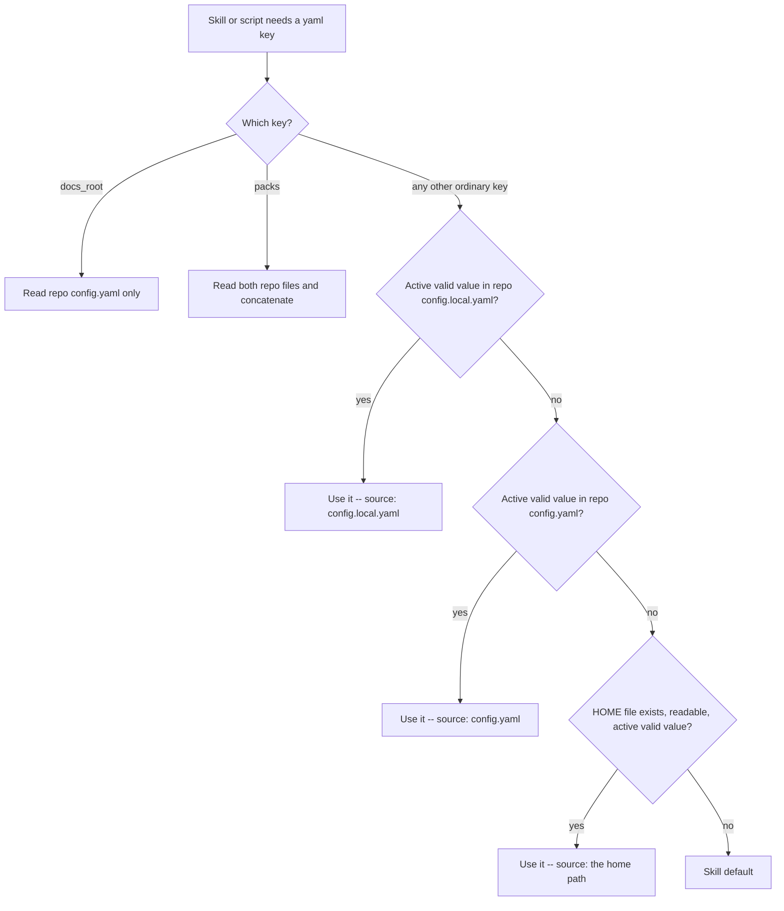

# User Home Config Layer - Plan

## Goal Capsule

- **Objective:** A person's own Compound Engineering preferences follow them into every repository they work in, without any of their colleagues seeing, inheriting, or having to accommodate those preferences — and without a team's committed setting ever being silently overridden.
- **Means:** Add a third, lowest-precedence read layer at `~/.compound-engineering/config.yaml` to the existing ordinary-key cascade (KTD1).
- **Product authority:** This plan governs the read order for ordinary CE yaml keys, what `check-health` reports, and the documented config surface. It supersedes R1 and the "Repo files only" Key Decision of `docs/plans/2026-08-12-002-fix-repo-config-cascade-plan.md`; every other requirement of that plan (R2–R12) stays in force and must still hold when this work lands.
- **Execution profile:** Skill prose duplicated behind a parity fixture, one bash health script, docs and template, mechanical plus behavioral tests. No runtime resolver library, no new script, no new dependency.
- **Open blockers:** None.
- **Tail ownership:** Implementation owns the edits, `bun run test`, and `bun run release:validate` when config-surface wording the validator watches changes. Shipping is a standalone PR to `EveryInc/compound-engineering` off a fresh `feat-user-home-config-layer` branch cut from `main`, preceded by a linked issue.

---

## Product Contract

### Summary

Ordinary CE yaml keys gain a third layer. Resolution becomes repo `.compound-engineering/config.local.yaml`, then repo `.compound-engineering/config.yaml`, then `~/.compound-engineering/config.yaml`. The home file is read-only for CE: nothing in the plugin writes or creates it. `docs_root` stays `config.yaml`-only, and `packs:` keeps its repo-only resolution as a named exception. The canonical rule text in `tests/fixtures/ce-config-layers-rule.md` and its eleven byte-identical copies change together, `skills/ce-setup/scripts/check-health` learns the third layer and a source label that distinguishes it, and the template plus `docs/guides/configuration.md` document the three-layer model.

### Problem Frame

Personal CE preferences have nowhere to live that is both durable and private. A repo's `config.yaml` is committed, so anything set there is imposed on the whole team; `config.local.yaml` is per-checkout and gitignored, so it has to be recreated in every repository and every fresh clone, and it is invisible to anyone setting up a new machine. The user's current workaround is a tracked `config.qchenevier.yaml` in one work repo with `config.local.yaml` symlinked to it — which requires telling every agent about the link, leaks a personal file into a shared repo, and still leaves every other repository with no personal config at all.

The August 2026 cascade work deliberately deferred this. Its scope boundary listed "user-home config" as out of scope and its Key Decision cited "home-dir config was sketched in March 2026 and never shipped." That was a sequencing judgment, not an architectural rejection: the two-layer cascade had to exist and be pinned by parity tests before a third layer could be added cheaply. It now does, and the March 2026 sketch's precedence ordering (`local > project > global`) is exactly the ordering settled here — so the deferral is being lifted against the same design, minus the durable-state redesign that surrounded it.

### Key Decisions

- **Home is the lowest layer.** (session-settled: user-directed — chosen over letting home beat the team's tracked file, and over a repo-side `pinned:` escape hatch: a team that commits a value keeps it, which is what makes the layer safe to propose upstream.) Governs R1, R12.
- **Every ordinary key, `docs_root` excluded.** (session-settled: user-directed — chosen over an explicit personal-preference allowlist, which is a list to maintain and whose silently-ignored keys surprise users, and over also allowing `docs_root`, which resolves to a writable path inside the repo and was deliberately carved out.) Governs R2, R7.
- **One fixed path, `~/.compound-engineering/config.yaml`.** (session-settled: user-directed — chosen over an env override and over an XDG-style lookup chain: one path to document, and it matches the directory the March 2026 sketch already named.) Governs R3.
- **`packs:` stays repo-only.** (session-settled: user-directed — chosen over teaching `packs-resolve.py` the third file: that script is byte-duplicated across seven skill directories and would need new cross-layer ordering and duplicate-id semantics, and personal packs are already reachable because a pack `source` may be a `~/` path.) Governs R6.

### Requirements

**Read cascade**

- R1. For every ordinary CE yaml key, resolve `<repo-root>/.compound-engineering/config.local.yaml`, then `<repo-root>/.compound-engineering/config.yaml`, then `~/.compound-engineering/config.yaml`. The first active (non-commented) value wins. This supersedes R1 of `docs/plans/2026-08-12-002-fix-repo-config-cascade-plan.md`, which forbade reading any user-home CE config.
- R2. The home file may set every ordinary key. `docs_root` is never read from it, exactly as it is never read from `config.local.yaml`.
- R3. The home file's location is the literal path `~/.compound-engineering/config.yaml`, where `~` is the invoking user's home directory. No environment-variable override, no XDG lookup chain, no per-project subdirectory.
- R4. A missing `~/.compound-engineering/` directory, a missing file, an unreadable file, or a malformed file is skipped the way a missing repo file is skipped today: resolution continues, and the outcome is the skill default rather than an error. An invalid value in the home file falls through to the skill default under the same clause that already sends an invalid repo value to the next layer.
- R5. Structured ordinary keys (lists and maps such as `work_engine_preferences` and `feedback_sources`) replace the whole key at whichever layer first sets them, including when that layer is the home file and the value is empty. No deep merging across layers.
- R6. `packs:` resolves from the repo files only and is documented as a named exception to R1. A personal pack is reached by giving a repo-file `packs:` entry a `~/`-rooted `source`.
- R7. `sweep_state_path` and `pr_teaching_archive` resolve as ordinary keys under R1, so a home-level value applies in every repo. `docs/guides/configuration.md` warns that both name repo-relative paths, so a home-level value is only sensible when it is meaningful in every repository (for example a `/tmp` `sweep_state_path`).

**Writes and setup**

- R8. No skill and no script writes, creates, seeds, or migrates `~/.compound-engineering/config.yaml`. `/ce-setup` never creates it and never offers to. Pulse, sweep, and promote keep persisting their keys to repo `config.local.yaml` per R10 of the August plan.
- R9. `/ce-setup` reports the home file as a present or absent read layer alongside the two repo layers. Its absence is never a project issue. Setup's create offer, its never-overwrite guarantee, and its gitignore offer stay scoped to the repo files.

**Health, docs, and parity**

- R10. `check-health` resolves ordinary scalars, review-scope keys, structured keys, and `work_engine_preferences` across all three layers, and labels the winning layer with a form that distinguishes the home file from the two repo files.
- R11. The canonical rule in `tests/fixtures/ce-config-layers-rule.md` states the three-layer cascade and is byte-identical in all eleven consumers. The revised block fits inside the 8000-byte CRLF-adjusted `SKILL.md` budget for each of the four consumer `SKILL.md` files, the tightest of which has 133 bytes of headroom.
- R12. R2–R12 of `docs/plans/2026-08-12-002-fix-repo-config-cascade-plan.md` continue to hold: the repo-file order is unchanged, `docs_root` stays `config.yaml`-only, setup still creates `config.yaml` and never `config.local.yaml`, gitignore status still does not affect resolution, and first-run detection stays "key unset after cascade."

### Actors

- A1. An individual using CE across several repositories, some of them shared with colleagues.
- A2. A team that commits `.compound-engineering/config.yaml` and expects its values to hold for everyone.
- A3. An agent running a CE skill that needs one yaml key.

### Key Flows

- F1. Personal default in an unconfigured repo
  - **Trigger:** A3 resolves `plan_output` in a repo with no `.compound-engineering/` directory.
  - **Steps:** Both repo files are absent and skipped. The home file sets `plan_output: html`.
  - **Outcome:** HTML, in every repo the person works in, with nothing committed anywhere.
- F2. Team value beats a personal one
  - **Trigger:** A3 resolves the same key in A2's repo, which commits `plan_output: md`.
  - **Steps:** No local file. `config.yaml` sets the key; resolution stops there and never reaches the home file.
  - **Outcome:** Markdown. A2's committed choice is what runs, which is the property that makes the layer safe to ship upstream.
- F3. Health report on a machine with a home config
  - **Trigger:** A1 runs `/ce-setup`.
  - **Steps:** Health reports which of the three layers exist and, per resolved key, which layer supplied the winning value.
  - **Outcome:** A1 can see that a surprising setting came from their home file rather than from the repo. Setup writes nothing to `$HOME`.

### Acceptance Examples

- AE1. Home-only ordinary default. Covers R1, F1.
  - **Given:** Neither repo config file exists and `~/.compound-engineering/config.yaml` has `plan_output: html`.
  - **When:** `ce-plan` resolves output mode.
  - **Then:** It uses HTML, not the markdown skill default.
- AE2. Tracked beats home. Covers R1, R12, F2.
  - **Given:** `config.yaml` has `plan_output: md` and the home file has `plan_output: html`.
  - **When:** `ce-plan` resolves output mode.
  - **Then:** It uses markdown.
- AE3. Local beats home with no tracked file. Covers R1.
  - **Given:** `config.local.yaml` has `work_engine_mode: off` and the home file has `work_engine_mode: prefer`.
  - **When:** `check-health` resolves the engine mode.
  - **Then:** The mode is `off`, sourced from `config.local.yaml`.
- AE4. `docs_root` ignores home. Covers R2.
  - **Given:** The home file has `docs_root: ~/ce-artifacts` and `config.yaml` sets no `docs_root`.
  - **When:** Any skill resolves the artifact root.
  - **Then:** The root is the default `docs`, and health reports the home `docs_root` as ignored rather than acting on it.
- AE5. Absent home directory is not an error. Covers R4.
  - **Given:** `~/.compound-engineering/` does not exist.
  - **When:** `check-health` runs and any skill resolves any key.
  - **Then:** Behavior is byte-identical to today's two-layer behavior, with no warning and no project issue.
- AE6. Unreadable or malformed home file. Covers R4.
  - **Given:** `~/.compound-engineering/config.yaml` exists but is not readable, or contains text the flat reader cannot parse a value out of.
  - **When:** `check-health` runs.
  - **Then:** Resolution continues to the skill default, health does not crash, and the condition is reported as a skipped layer rather than counted as a project issue.
- AE7. Invalid home scalar falls to the default. Covers R4.
  - **Given:** Only the home file sets `cross_model_code_review_scope`, to `everything`.
  - **When:** `check-health` resolves that key.
  - **Then:** The scope is `default`, and the warning names the home file as the source of the invalid value.
- AE8. Empty home list replaces nothing above it. Covers R5.
  - **Given:** `config.yaml` sets a non-empty `work_engine_preferences` and the home file sets `work_engine_preferences: []`.
  - **When:** `check-health` resolves the key.
  - **Then:** The repo list wins, because resolution stops at the first layer that sets the key and the home file is last.
- AE9. Setup leaves `$HOME` alone. Covers R8, R9.
  - **Given:** No `~/.compound-engineering/` directory.
  - **When:** The operator accepts every offer `/ce-setup` makes.
  - **Then:** `.compound-engineering/config.yaml` and `config.example.yaml` exist in the repo, and nothing was created under `$HOME`.
- AE10. Personal packs via a home-rooted source. Covers R6.
  - **Given:** The home file lists `packs:` entries and `config.yaml` does not.
  - **When:** Pack discovery runs.
  - **Then:** No packs resolve from the home file; the documented route is a repo-file `packs:` entry whose `source` is a `~/` path.

### Success Criteria

- A person with one `~/.compound-engineering/config.yaml` gets their preferences in a repo they have never configured, and commits nothing to reach that.
- No committed team value changes behavior as a result of this work.
- A colleague who never creates the home directory sees behavior identical to today, including in `check-health` output.
- The change reads as a self-contained upstream contribution: one cascade layer, one fixture, one script, one docs surface.

### Scope Boundaries

**In scope:** the third read layer for ordinary keys; `check-health` resolution and source labels; the canonical rule fixture and its eleven copies; the parity test's pinned clauses; the config template, `docs/guides/configuration.md`, `docs/guides/ce-setup.md`, and the AGENTS.md config-maintenance rule; behavioral tests with a sandboxed `HOME`.

**Out of scope, deliberately:**

- `packs:` resolution (R6) — repo-only, documented exception.
- `docs_root` (R2) — stays `config.yaml`-only.
- Any relocation of CE scratch, todos, pack caches, or durable state out of the repo or `/tmp`. This plan creates the first CE-owned path under `$HOME` and creates nothing else there.
- Deep merging of lists or maps across layers (R5).
- An environment-variable override or XDG lookup chain (R3).
- Any code path that writes, creates, or migrates the home file (R8).
- A shared runtime config resolver. KTD2 of the August plan stands: skills cannot import siblings, and the rule is duplicated prose, not a library.

### Deferred to Follow-Up Work

- A `/ce-setup` mode that shows a machine-wide summary of the home layer across repos.
- A documented migration helper for people who, like the motivating user, currently keep a personal config as a tracked file plus symlink.

### Sources

- `docs/plans/2026-08-12-002-fix-repo-config-cascade-plan.md` — the plan this one amends; R1 and the "Repo files only" Key Decision are superseded, KTD2 (no shared runtime resolver) is honored.
- `docs/brainstorms/2026-03-25-config-storage-redesign-requirements.md` — R2 proposed the same `local > project > global` precedence; R17's env/XDG fallback chain and the surrounding durable-state redesign are not adopted.
- `tests/fixtures/ce-config-layers-rule.md` and `tests/config-layers-rule-parity.test.ts` — the canonical block, its hard-coded `CONSUMERS` list, and the clause-pinning test that must be updated with it.
- `skills/ce-setup/scripts/check-health` — `read_flat_config_value`, `resolve_ordinary_scalar`, `resolve_review_scope`, `resolve_structured_layer`, `read_work_engine_preferences`, `resolve_docs_root`, and the `ordinary_source` label consumed as "from ${source}".
- `tests/skills/ce-setup-check-health.test.ts` — already overrides `HOME` to the sandbox cwd per test; the pattern the new cases reuse.
- `tests/codex-skill-prompt-budget.test.ts` — the 8000-byte CRLF-adjusted `SKILL.md` bound and its ratchet-down `OVER_BUDGET` set.
- `docs/guides/configuration.md` — the two-file framing, the packs concatenation paragraph, and the options table that this work updates.

---

## Planning Contract

### Key Technical Decisions

- KTD1. **Third layer, appended at the bottom of the existing cascade.** (session-settled: user-directed — chosen over letting home beat the team's tracked file, and over a repo-side `pinned:` escape hatch: a team that commits a value keeps it, which is what makes the layer safe to propose upstream.) Governs R1, R12. Mechanically this means every resolver and every prose rule appends one more step after `config.yaml`; no existing comparison or precedence test changes its expected outcome.
- KTD2. **Extend the Read clause; do not add a bullet.** The canonical block's `**Read**` clause names three files in one sentence instead of gaining a fourth bullet. `skills/ce-brainstorm/SKILL.md` and `skills/ce-product-pulse/SKILL.md` have 133 and 135 bytes of CRLF-adjusted headroom under the 8000-byte bound, so a bullet-sized growth would push both over and force either a restructure of two skills or two new `OVER_BUDGET` entries — and that set is a ratchet that never takes new names. Rewording tightens the block enough to absorb the third path. Governs R11.
- KTD3. **One fixed path resolved from `$HOME`, with no new helper.** (session-settled: user-directed — chosen over an env override and over an XDG-style lookup chain: one path to document, and it matches the directory the March 2026 sketch already named.) Governs R3. `check-health` composes `$HOME/.compound-engineering/config.yaml` at the same place it composes the two repo paths from `git rev-parse --show-toplevel`; prose tells agents the literal `~/` path.
- KTD4. **Home resolution reuses the repo's own absence semantics.** Governs R4. `read_flat_config_value` is guarded by the same `[ -f "$file" ]` test the repo layers use, extended to require readability, so a missing directory, a missing file, and an unreadable file all collapse into "layer skipped." The deliberately-not-a-YAML-parser awk one-liner stays as is: a malformed file simply yields no value, which is already the shape of an unset key.
- KTD5. **Source labels become path-shaped for the home layer only.** Governs R10. `ordinary_source` today carries the bare filenames `config.local.yaml` and `config.yaml`, which are printed as "from ${source}" and are asserted verbatim in existing tests. The home layer takes a distinct label of the form `~/.compound-engineering/config.yaml` rather than a bare `config.yaml` that would be ambiguous with the repo file. Existing repo labels are left untouched so the current assertions keep their meaning.
- KTD6. **`resolve_review_scope`'s continuation loop generalizes to a layer list.** Governs R4, R10. Its current shape hard-codes "if the source was local, try tracked once." With three layers that special case becomes a loop over the ordered, existing layers, so an invalid value in any layer continues to the next and the final fallback stays `default`. Same for the `work_engine_mode` invalid-value fallback, which today only re-reads the tracked file when the bad value came from local.
- KTD7. **`packs:` is left alone and named as an exception in prose.** (session-settled: user-directed — chosen over teaching `packs-resolve.py` the third file: that script is byte-duplicated across seven skill directories and would need new cross-layer ordering and duplicate-id semantics, and personal packs are already reachable because a pack `source` may be a `~/` path.) Governs R6. `packs:` is also the one key whose repo layers *concatenate* rather than override, so folding a third layer in would mean deciding concatenation order and duplicate-id behavior across a trust boundary — work this plan does not take on.
- KTD8. **`docs_root` keeps its own rule block untouched.** Governs R2. The `<!-- ce-docs-root -->` block already says `config.yaml` only; the home layer adds nothing to it. The ordinary-key block keeps its existing "Do not use this rule for `docs_root`" clause, which the parity test pins. `resolve_docs_root` gains only the reporting of an ignored home `docs_root`, mirroring `docs_root_local_ignored`.

### High-Level Technical Design

The new layer is strictly additive at the bottom. Every path that terminates in `useLocal`, `useTracked`, `repoOnly`, or `packsOnly` behaves exactly as it does today; only runs that reach the skill default today can now land on `useHome` instead.

### Assumptions

- `$HOME` is set in every environment where a CE skill or `check-health` runs. Where it is not, the layer is simply absent — which R4 already makes a non-event.

### Implementation Constraints

- Cross-skill file references are forbidden. Duplicate the rule block; never `@`-include it.
- `skills/ce-setup/references/config-template.yaml` and `.compound-engineering/config.example.yaml` stay byte-identical.
- No manual version bumps in plugin or marketplace manifests.
- Tests must never read the developer's real home directory; every case that exercises the home layer sets `HOME` into its sandbox.
- The revised canonical block must leave every consumer `SKILL.md` under the 8000-byte CRLF-adjusted bound, and must not add a name to `OVER_BUDGET`.

### Sequencing

U1 first: the canonical text is what every other unit describes or asserts. U2 and U3 are independent of each other once U1 lands. U4 closes on U2's behavior and is checked last.

---

## Implementation Units

### U1. Rewrite the canonical cascade rule and propagate it

**Goal:** The one canonical statement of the ordinary-key cascade names three layers, is byte-identical in all eleven consumers, and fits every consumer's prompt budget.

**Requirements:** R1, R2, R4, R5, R6, R11, R12

**Dependencies:** none

**Files:**
- `tests/fixtures/ce-config-layers-rule.md`
- `skills/ce-plan/references/output-mode.md`
- `skills/ce-brainstorm/SKILL.md`
- `skills/ce-ideate/SKILL.md`
- `skills/ce-product-pulse/SKILL.md`
- `skills/ce-sweep/SKILL.md`
- `skills/ce-commit-push-pr/references/compose.md`
- `skills/ce-commit-push-pr/references/apply-and-handoff.md`
- `skills/ce-work/references/execution-engines.md`
- `skills/ce-promote/references/spiral-cli.md`
- `skills/ce-code-review/references/cross-model-review.md`
- `skills/ce-doc-review/references/cross-model-review.md`
- `tests/config-layers-rule-parity.test.ts`

**Approach:**
1. Rewrite the fixture's opening sentence so it no longer says the keys come from "the two repo files," and extend the `**Read**` clause to name the repo local file, the repo tracked file, and `~/.compound-engineering/config.yaml` in that order, per KTD2 — one sentence, no new bullet.
2. Extend the skip clause so a missing home directory, missing file, or unreadable file is skipped like a missing repo file (R4), and keep "Gitignore does not change resolution" verbatim.
3. Keep the `**Win**` clause's existing scalar, invalid-value, and present-list semantics unchanged; they already describe R5 correctly once a third layer exists.
4. Add the `packs:` exception to the existing `**Do not**` clause alongside `docs_root`, naming the `~/`-rooted `source` route (R6).
5. Paste the revised block, byte-for-byte, into all eleven consumers listed above.
6. Update `tests/config-layers-rule-parity.test.ts`: the clause-pinning test's expectations must move from the current two-file phrasing to the new clauses, including a pin on the home path and on the `packs:` exception.

**Patterns to follow:** The existing delimited-block plus parity-fixture pattern; the block is the implementation, not a grep target.

**Test scenarios:**
- The fixture defines exactly one delimited block, with the start and end markers appearing once each.
- Each of the eleven consumers contains the revised block verbatim; removing it from any one of them fails the test with that file named.
- The pinned clauses include the home path, the three-file read order, "Gitignore does not change resolution", "invalid value continues to the next layer", "including an empty list or map", and both the `docs_root` and `packs` exceptions.
- No consumer still asserts or contains a two-repo-file phrasing of the rule.
- Each of the four consumer `SKILL.md` files is at or under 8000 CRLF-adjusted bytes, and `OVER_BUDGET` gains no new name.
- The cross-model peer-resolution test still holds: both `cross-model-review.md` files contain "invalid value continues to the next layer" and neither contains "first active value wins".
- Pulse and sweep first-run wording still keys off "unset after cascade", not a missing file.

**Verification:** `tests/config-layers-rule-parity.test.ts` and `tests/codex-skill-prompt-budget.test.ts` are green, and a diff of any consumer's block against the fixture is empty.

---

### U2. Teach `check-health` the third layer

**Goal:** Every ordinary-key resolver in the health script reads the home file last and reports which of the three layers won.

**Requirements:** R1, R2, R4, R5, R10, R12

**Dependencies:** U1

**Files:**
- `skills/ce-setup/scripts/check-health`

**Approach:**
1. Compose the home config path once, next to where `local_config_path` and `tracked_config_path` are composed from `git rev-parse --show-toplevel`, and make the whole ordinary-key section operate over an ordered list of the three paths rather than two named variables.
2. Extend `resolve_ordinary_scalar` to try the third layer after the tracked file, setting `ordinary_source` to the home label from KTD5 and leaving the two existing labels untouched.
3. Generalize `resolve_review_scope`'s continuation so an invalid value in any layer continues to the next and the final fallback is still `default`, with each warning naming the layer that carried the bad value (KTD6).
4. Generalize the `work_engine_mode` invalid-value fallback the same way, so a bad value in any layer continues down rather than only local-continues-to-tracked.
5. Extend `resolve_structured_layer` so a present key — including an empty list or map — in the home file wins when neither repo file sets it, and let `read_work_engine_preferences` run against whichever file `structured_layer` selected, including the home file.
6. Extend the retired-key scan and the `work_engine_target` / `work_engine_model` migration scan to the home file, so a retired key hiding in a personal config is reported rather than silently ignored.
7. Guard every home read on file existence and readability; a missing directory, missing file, or unreadable file skips the layer without a warning and without incrementing `project_issues` (R4).
8. In `resolve_docs_root`, report a `docs_root` found in the home file as ignored, mirroring `docs_root_local_ignored`, and never let it supply a value (R2).
9. Add the home file to the layer-presence report as present or absent, never as a project issue (R9).

**Patterns to follow:** The existing `docs_root_local_ignored` reporting shape; the deliberately-not-a-YAML-parser posture of `read_flat_config_value`; the existing `from ${source}` detail line.

**Test scenarios:** Enumerated in U4 — this unit's behavior is proven there.

**Execution note:** The bash resolvers are the one place in this change where a cascade is actually implemented rather than described; land them before the docs unit so the documented labels match what the script prints.

**Verification:** Running the script in a checkout with a home config, a repo config, or neither produces the layer report and per-key source labels R10 describes, and a checkout with no `~/.compound-engineering/` directory produces output identical to today's.

---

### U3. Document the three-layer model

**Goal:** The template header, the configuration guide, the setup guide, and the AGENTS.md maintenance rule all describe three layers, the two exceptions, and the fact that CE never writes the home file.

**Requirements:** R2, R3, R6, R7, R8, R9, R12

**Dependencies:** U1

**Files:**
- `skills/ce-setup/references/config-template.yaml`
- `.compound-engineering/config.example.yaml`
- `docs/guides/configuration.md`
- `docs/guides/ce-setup.md`
- `skills/ce-setup/SKILL.md`
- `AGENTS.md`

**Approach:**
1. Rewrite the template header's opening comment block: the copy target is still repo `config.yaml`; `config.local.yaml` is still the per-checkout override; add the home file as the personal lowest layer that CE reads and never writes, and keep the `docs_root` carve-out sentence.
2. Regenerate `.compound-engineering/config.example.yaml` so it stays byte-identical to the template.
3. In `docs/guides/configuration.md`, restate the cascade once under "How keys resolve" with all three layers, keep the `docs_root` line, and add the `packs:` exception with the `~/`-rooted `source` route next to the existing concatenation paragraph.
4. Add the R7 warning to the same guide: `sweep_state_path` and `pr_teaching_archive` resolve as ordinary keys, and both name repo-relative paths, so a home-level value only makes sense when it is meaningful in every repository.
5. Add a short "Personal defaults" section to the guide covering the fixed path, what belongs there, that nothing in CE writes it, and that a committed team value always wins.
6. Update `docs/guides/ce-setup.md` so the "what it does not do" row and the repo-local-state list name the home file as a read-only layer setup reports but never creates.
7. Update `skills/ce-setup/SKILL.md` so the health-report step mentions the third layer and the create offer stays scoped to `config.yaml`; keep the edit small enough that the skill stays inside its prompt budget.
8. Update AGENTS.md's config-maintenance bullet: a key change still updates the template, the byte-identical example, `docs/guides/configuration.md`, and the consumer skill docs, and the bullet now names the home file as the lowest ordinary-key layer with `docs_root` and `packs:` excluded.

**Patterns to follow:** The template's existing commented-key style; the guide's existing "How keys resolve" bullets; the AGENTS.md four-file maintenance rule.

**Test scenarios:**
- Template and `.compound-engineering/config.example.yaml` are byte-identical after the edit.
- The configuration guide names all three layers in one place, the `docs_root` exception, and the `packs:` exception.
- No shipping doc still describes ordinary keys as coming from two files only.
- `docs/guides/ce-setup.md` states that setup never creates the home file.
- `skills/ce-setup/SKILL.md` stays inside the 8000-byte CRLF-adjusted bound.

**Verification:** `diff` of template against the example is empty; `bun run release:validate` passes; a reader of `docs/guides/configuration.md` alone can state the full precedence order and both exceptions.

---

### U4. Pin the layer behavior with sandboxed-`HOME` tests

**Goal:** CI proves the third layer resolves last, that its absence changes nothing, and that a malformed or unreadable home file degrades quietly.

**Requirements:** R1, R2, R4, R5, R8, R9, R10

**Dependencies:** U2

**Files:**
- `tests/skills/ce-setup-check-health.test.ts`

**Approach:**
1. Extend the existing per-test sandbox so a case can seed `$HOME/.compound-engineering/config.yaml`; the harness already sets `HOME` to the sandbox cwd, so no case may reach the developer's real home.
2. Add resolution cases for each precedence pair, per the scenarios below.
3. Add degradation cases for absent directory, unreadable file, and malformed content.
4. Re-run the existing two-layer cases unchanged; any that now need a new expectation is a precedence regression, not a test to relax.

**Patterns to follow:** The existing `HOME: cwd` / `CODEX_HOME` environment override in the test harness; the existing per-key health assertions on "from ${source}".

**Test scenarios:**
- Covers AE1. Home-only `work_engine_mode: prefer` with a valid home `work_engine_preferences` list and no repo files: health reports `prefer` sourced from the home path.
- Covers AE2. Tracked `config.yaml` and home file both set `work_engine_mode`: health reports the tracked value and labels the tracked file.
- Covers AE3. Local and home both set the key, no tracked file: health reports the local value.
- Covers AE4. Home file sets `docs_root`: the artifact root is the default `docs`, and health reports the home `docs_root` as ignored.
- Covers AE5. No `~/.compound-engineering/` directory: output matches the current two-layer expectations byte-for-byte, with no warning and no added project issue.
- Covers AE6. Home file exists but is unreadable, and separately, contains content the flat reader yields nothing from: health completes, resolution falls to the default, and neither case increments `project_issues`.
- Covers AE7. Only the home file sets `cross_model_code_review_scope`, to an invalid value: the resolved scope is `default` and the warning names the home file.
- Covers AE8. Home `work_engine_preferences: []` with a non-empty tracked list: the tracked list wins.
- Covers AE8. Home `work_engine_preferences` list with neither repo file setting the key: the home list is read and its entries are reported.
- A retired key (`plan_use_fable`, `work_engine_target`) set actively in the home file is reported in the retired-key scan.
- Covers AE9. A setup run that accepts every offer creates nothing under the sandbox `$HOME`.

**Verification:** `bun test tests/skills/ce-setup-check-health.test.ts` is green, and each new case fails if the corresponding home-layer branch is reverted in `check-health`.

---

## Verification Contract

| Gate | Command / check | Applies |
|---|---|---|
| Rule parity | `bun test tests/config-layers-rule-parity.test.ts` | After U1 |
| Prompt budget | `bun test tests/codex-skill-prompt-budget.test.ts` | After U1 and U3; `OVER_BUDGET` must gain no name |
| Health behavior | `bun test tests/skills/ce-setup-check-health.test.ts` | After U2 and U4 |
| Template identity | `diff` of `skills/ce-setup/references/config-template.yaml` against `.compound-engineering/config.example.yaml` | After U3 |
| Full suite | `bun run test` | Before review / PR |
| Release metadata | `bun run release:validate` | After U3, since config-surface wording changes |
| Behavioral eval | none | Skill prose is the runtime; parity and health tests pin the contract |

---

## Definition of Done

- Ordinary keys resolve repo local, then repo tracked, then `~/.compound-engineering/config.yaml`.
- A committed team value never loses to a home value.
- `docs_root` and `packs:` remain repo-scoped, and both exceptions are stated in the canonical block and the configuration guide.
- Nothing in the plugin writes, creates, or migrates the home file.
- A machine with no `~/.compound-engineering/` directory behaves exactly as it does today, including in health output.
- Every requirement R2–R12 of `docs/plans/2026-08-12-002-fix-repo-config-cascade-plan.md` still holds.
- `bun run test` passes and no name was added to `OVER_BUDGET`.
- No experimental or dead-end code from abandoned approaches remains in the diff — in particular, no partially-generalized resolver left beside the one that ships.

### Per-unit

| Unit | Done when |
|---|---|
| U1 | The fixture states three layers and both exceptions; all eleven consumers match it verbatim; every consumer `SKILL.md` fits the budget |
| U2 | Every ordinary-key resolver reads the home layer last and labels it distinctly; absence is silent |
| U3 | Template and example are byte-identical; the guide states the full precedence order, both exceptions, and the R7 path warning |
| U4 | Each precedence pair and each degradation case has a test that fails when its `check-health` branch is reverted |

---

## System-Wide Impact

This is the first CE-owned path under `$HOME`. Until now CE has only ever read other tools' home files (Codex `AGENTS.md`, harness session logs) and kept its own scratch and pack caches in `/tmp`. The layer is read-only by design (R8), so the directory exists only because a person created it, and CE's behavior when it is absent — the common case — is unchanged.

Agents remain the runtime for every skill-side read: the cascade is prose they follow, not a resolver they call. That keeps KTD2 of the August plan intact and is why the rule is duplicated into eleven files rather than centralized.

Worktrees of the same project share the committed `config.yaml` and now also share the home layer, since it is per-user rather than per-checkout. A per-checkout `config.local.yaml` still shadows both.

## Risks

- **Prompt-budget overrun.** `skills/ce-brainstorm/SKILL.md` and `skills/ce-product-pulse/SKILL.md` have roughly 130 bytes of headroom each. A block that grows by a bullet breaks both. Mitigated by KTD2 and pinned by the budget test in U1's scenarios.
- **Ambiguous source labels.** `check-health` prints "from ${source}" and existing tests assert the bare filenames. A home label of `config.yaml` would be indistinguishable from the repo file and would make a surprising setting untraceable. Mitigated by KTD5's path-shaped label.
- **Hidden precedence surprise for teams.** Someone with a home config debugging a colleague's repo may see behavior the colleague cannot reproduce. Mitigated by R10's per-key source labels, which name the layer in the health report.
- **Partial generalization of the bash resolvers.** `resolve_review_scope` and the `work_engine_mode` fallback each carry a hard-coded local-to-tracked step. Generalizing one and not the other yields a script where some keys cascade through three layers and others through two. U2 steps 3 and 4 must land together, and U4 covers both.
- **Scope drift into the March 2026 redesign.** That brainstorm bundled this cascade with `user_state_dir`, per-project directories, and todo relocation. Adopting any of it here would turn a proposable upstream PR into a storage rewrite. The Scope Boundaries section names each piece explicitly.

## Documentation / Operational Notes

This is intended as a standalone pull request to `EveryInc/compound-engineering`, opened from a `feat-user-home-config-layer` branch cut from `main`. Two conditions attach to that:

- **File the linked issue first.** The PR should reference an issue that states the problem (personal preferences have no durable private home) and the settled precedence, so the upstream discussion happens on the design rather than inside a diff review.
- **No dependency on `feat-review-engine-all-reviewers-cross-model`.** That branch is unrelated work. Cut from `main`, rebase on `main`, and do not pick up its commits — the two branches happen to touch `skills/ce-code-review/references/cross-model-review.md` and `skills/ce-doc-review/references/cross-model-review.md`, so a conflict there is expected and is resolved by keeping both intents, never by taking one side wholesale.

The PR body fills the `## Security Disclosure` and `## Agent Disclosure` sections of the repo's template. The security-relevant fact worth stating: this change makes CE read one new file outside the repository, read-only, at a fixed path, with no execution of its contents.
